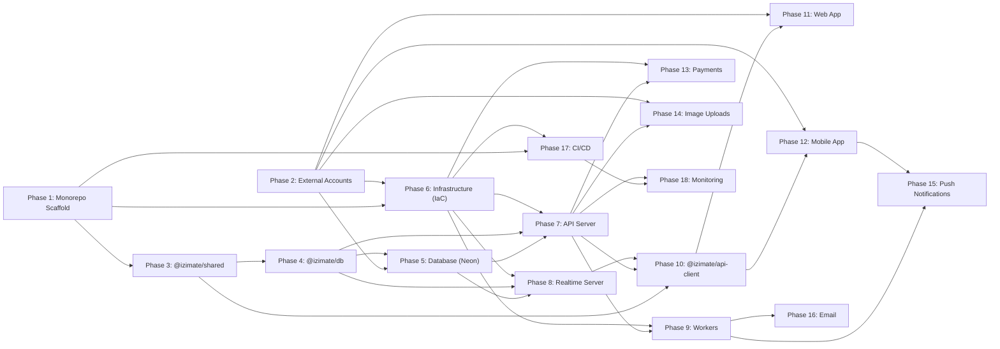
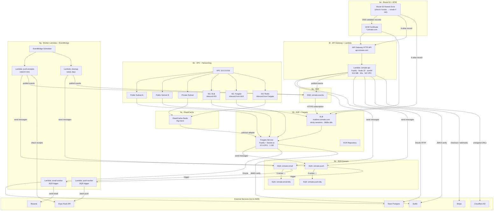

# iZimate v2 — Implementation Plan

> Derived from [SYSTEM_DESIGN.md](SYSTEM_DESIGN.md). Each phase lists its **prerequisites**, **deliverables**, and **exit criteria** so work can be parallelized where dependencies allow.

---

## Phase Dependency Map



> **Note:** Phase 1 and Phase 2 have **no** dependency on each other — they run in parallel.

---

## Infrastructure Dependency Map (Phase 6 Detail)

Shows every AWS resource, its internal dependencies, and connections to external services.



### How Resources Connect (Quick Reference)

| Producer | → | Consumer | Channel |
|----------|---|----------|---------|
| API Lambda, Cron Lambdas | → | Email Worker | SQS `izimate-email` |
| API Lambda, Cron Lambdas, Fargate | → | Push Worker | SQS `izimate-push` |
| API Lambda, Cron Lambdas | → | Fargate (Socket.io) | SNS `izimate-events` → HTTPS → ALB |
| EventBridge Scheduler | → | `push-receipts` Lambda | Cron: `rate(15 min)` |
| EventBridge Scheduler | → | `cleanup` Lambda | Cron: `rate(1 day)` |
| SQS email queue | → | DLQ (email) | After 3 failed retries |
| SQS push queue | → | DLQ (push) | After 3 failed retries |
| Fargate instances | ↔ | Fargate instances | Redis pub/sub adapter |
| Route 53 | → | ACM | DNS validation records |
| ACM cert | → | API Gateway, ALB | TLS termination |

---

## Phase 1 — Monorepo Scaffolding

**Prerequisites:** None (greenfield start)
**Estimated effort:** 1–2 days

### Deliverables

1. **Root workspace config**
   - `pnpm-workspace.yaml` declaring `apps/*` and `packages/*`
   - Root `package.json` with workspace scripts (`build`, `dev`, `lint`, `typecheck`, `test`)
   - Root `tsconfig.json` (base config, strict mode, paths)
   - `.npmrc` (hoist patterns for Expo/React Native compatibility)
   - `.gitignore`, `.editorconfig`, `.prettierrc`, `eslint.config.js`

2. **App stubs** — empty `package.json` + `tsconfig.json` for each:
   - `apps/mobile` (Expo SDK 54, Expo Router v6)
   - `apps/web` (Next.js 16, App Router)
   - `apps/api` (Fastify 5, `@fastify/aws-lambda`)
   - `apps/realtime` (Fastify 5, Socket.io 4)
   - `apps/workers` (bare Lambda handlers)

3. **Package stubs** — empty `package.json` + `tsconfig.json` + `src/index.ts` for each:
   - `packages/shared` (`@izimate/shared`)
   - `packages/api-client` (`@izimate/api-client`)
   - `packages/db` (`@izimate/db`)

4. **Infra directory**
   - `infra/` scaffolded for Pulumi (TypeScript, S3 state backend)
   - `Pulumi.yaml` (project definition), `Pulumi.prod.yaml`, `Pulumi.staging.yaml`
   - `index.ts` entry point + per-resource modules (`vpc.ts`, `lambda.ts`, `sqs.ts`, `sns.ts`, `eventbridge.ts`, `fargate.ts`, `elasticache.ts`, `alb.ts`, `api-gateway.ts`)

5. **Verify** — `pnpm install` succeeds, `pnpm -r run build` succeeds (empty builds), all internal `workspace:*` references resolve.

### Exit Criteria
- All workspace packages resolve correctly.
- A change in `packages/shared` is picked up by `apps/api` during dev.
- `pnpm typecheck` passes across the entire workspace.

---

## Phase 2 — External Service Accounts & Configuration

**Prerequisites:** None (can run in parallel with Phase 1)
**Estimated effort:** 1–2 days

### Deliverables

| Service | Setup Tasks |
|---------|------------|
| **Auth0** | Create tenant → create SPA application (mobile) → create Regular Web application (web) → create API audience (`api.izimate.com`) → configure social connections (Google, Apple) → note `AUTH0_DOMAIN`, `AUTH0_CLIENT_ID`, `AUTH0_AUDIENCE` |
| **Neon** | Create project → create `dev` and `prod` databases → enable branching → note `DATABASE_URL` |
| **Cloudflare R2** | Create R2 bucket (`izimate-uploads`) → create API token with read/write → configure custom domain for CDN → note `R2_ACCOUNT_ID`, `R2_ACCESS_KEY_ID`, `R2_SECRET_ACCESS_KEY`, `R2_BUCKET_NAME` |
| **Stripe** | Create account → create Connect platform (if needed) → configure webhook endpoints → note `STRIPE_SECRET_KEY`, `STRIPE_WEBHOOK_SECRET`, `STRIPE_PUBLISHABLE_KEY` |
| **Resend** | Create account → verify domain (`izimate.com`) → create API key → note `RESEND_API_KEY` |
| **Sentry** | Create organization → create projects: `izimate-mobile`, `izimate-web`, `izimate-api`, `izimate-realtime` → note DSN per project |
| **Expo** | Create project on expo.dev → configure EAS → note `EXPO_PROJECT_ID` |
| **AWS** | Create IAM user/role for deployment → configure AWS CLI profile → note `AWS_ACCOUNT_ID`, `AWS_REGION` (domain/certs are handled automatically by IaC in Phase 6) |

### Environment Files
- Create `.env.example` at workspace root listing every required variable.
- Create per-app `.env.local` files (git-ignored) for local development.
- Document which env vars are needed by which app/package.

### Exit Criteria
- All service accounts created and API keys secured.
- `.env.example` is complete and documented.
- Auth0 tenant returns tokens for a test user.
- Neon database is reachable from a local Drizzle connection test.

---

## Phase 3 — `@izimate/shared` Package

**Prerequisites:** Phase 1 (monorepo structure exists)
**Estimated effort:** 3–5 days

### Deliverables

This package is **isomorphic** — zero server-only dependencies. Consumed by all apps and packages.

1. **`src/types/`** — Domain TypeScript types
   - User, profile, roles
   - Core business entities (domain-specific — determined by product requirements)
   - Enums for statuses, categories, etc.

2. **`src/schemas/`** — Zod validation schemas
   - One schema file per domain entity (e.g., `user.ts`, `resource.ts`)
   - Both "full" schemas (for API responses) and "create/update" schemas (for mutations)
   - Exported as named exports: `UserSchema`, `CreateUserSchema`, `UpdateUserSchema`, etc.

3. **`src/constants/`** — Shared constants
   - Status enums
   - Error codes
   - Pagination defaults
   - Feature flags type definitions

4. **`src/utils/`** — Pure utility functions
   - Currency formatting
   - Date formatting/parsing
   - Price calculation helpers
   - String utilities (slugify, truncate)

5. **`src/design/`** — Design tokens
   - Color palette
   - Spacing scale
   - Typography scale
   - Border radii, shadows

6. **Build config** — `tsup` or plain `tsc` to emit ESM + CJS + `.d.ts`

### Exit Criteria
- `pnpm --filter @izimate/shared build` succeeds.
- Zod schemas are importable and parseable in a test file.
- Types auto-complete in consuming apps (verified in IDE).
- No Node.js or server-only imports anywhere in the package.

---

## Phase 4 — `@izimate/db` Package

**Prerequisites:** Phase 3 (`@izimate/shared` for types/schemas)
**Estimated effort:** 5–7 days

### Deliverables

This package is **server-only** — never imported by mobile or web.

1. **`src/schema/`** — Drizzle table definitions (source of truth)
   - `users.ts` — users table
   - `push-tokens.ts` — Expo push tokens (multi-device)
   - `push-receipts.ts` — Expo ticket tracking for receipt checking
   - Domain entity tables (determined by product requirements)
   - All relations defined via Drizzle's `relations()` API

2. **`src/index.ts`** — DB client setup
   - Neon serverless HTTP driver (`@neondatabase/serverless`)
   - Drizzle ORM instance (`drizzle(neon(DATABASE_URL))`)
   - Re-export all schema tables and Drizzle operators (`eq`, `and`, `lte`, etc.)

3. **`src/auth.ts`** — JWT verification
   - `verifyToken(token: string)` using `jose` + Auth0 JWKS endpoint
   - Caches JWKS keys automatically (jose handles this)
   - Used by API, realtime, and workers

4. **`src/events.ts`** — SNS event publishing
   - `publishEvent(event: AppEvent)` helper
   - Uses `@aws-sdk/client-sns`
   - `AppEvent` type defined in `@izimate/shared`

5. **`src/queue.ts`** — SQS queue helpers
   - `queueEmail(to, template, data)` → email SQS queue
   - `queuePush(userId, title, body, data?)` → push SQS queue
   - Uses `@aws-sdk/client-sqs`

6. **Drizzle config** — `drizzle.config.ts` for migration generation

### Exit Criteria
- `pnpm --filter @izimate/db build` succeeds.
- `drizzle-kit generate` produces migration SQL.
- `verifyToken()` validates a real Auth0 JWT in a test.
- `db.select().from(users)` compiles with full type inference.

---

## Phase 5 — Database Setup & Migrations

**Prerequisites:** Phase 2 (Neon account), Phase 4 (`@izimate/db` schema defined)
**Estimated effort:** 1–2 days

### Deliverables

1. **Initial migration** — generated from Drizzle schema in Phase 4
   - All core tables: users, push_tokens, push_receipts, domain entities
   - Indexes on foreign keys and commonly queried columns
   - Full-text search indexes on searchable columns (tsvector)

2. **Apply to Neon dev branch**
   - `drizzle-kit push` for dev
   - `drizzle-kit migrate` for prod (committed migration files)

3. **Seed script** (`packages/db/src/seed.ts`)
   - Creates test users matching Auth0 test accounts
   - Creates sample domain data for development

4. **Branching workflow documented**
   - How to create a Neon branch for a PR
   - How to apply migrations to the branch
   - How to merge/delete branches

### Exit Criteria
- Dev database has all tables, relations, and indexes.
- Seed script populates test data.
- `db.select().from(users)` returns seeded rows.
- Migration files are committed and version-controlled.

---

## Phase 6 — Infrastructure (IaC)

**Prerequisites:** Phase 1 (repo exists), Phase 2 (AWS account configured)
**Estimated effort:** 5–8 days

> **IaC tool: Pulumi (TypeScript)** — same language as the app, state stored in S3.

### Sub-phases (ordered by dependency)

#### 6a. Route 53 Hosted Zone + ACM Certificates (Day 1)
- **Hosted zone** — Pulumi checks if a Route 53 hosted zone for `izimate.com` already exists:
  - If it exists → look up via `aws.route53.getZone()` data source
  - If it does not exist → create via `new aws.route53.Zone()`
  - Output the zone ID and name servers for use by all subsequent DNS records
- **ACM certificates** — created automatically after the hosted zone is confirmed:
  - `*.izimate.com` wildcard cert (covers `api.izimate.com`, `realtime.izimate.com`, etc.)
  - Or individual certs: `api.izimate.com` + `realtime.izimate.com`
  - DNS validation via Route 53 (`aws.acm.CertificateValidation` + `aws.route53.Record`)
  - Waits for validation to complete before downstream resources reference the cert ARN
- **Important:** If the domain registrar is not Route 53, the output name servers must be set as NS records at the registrar. The IaC should output the name servers clearly for this step.

#### 6b. VPC + Networking (Day 1–2)
- VPC `10.0.0.0/16`
- 2 public subnets (AZ-a, AZ-b) for Fargate
- 1 private subnet for ElastiCache Redis
- Security groups:
  - `sg-fargate`: inbound from ALB only (port 3001), outbound all
  - `sg-redis`: inbound from `sg-fargate` only (port 6379), no outbound
  - `sg-alb`: inbound 443 from internet, outbound to `sg-fargate`

#### 6c. ElastiCache Redis (Day 2)
- `t4g.micro` in private subnet
- Single-node (no cluster needed at startup)
- Security group `sg-redis`
- Output: `REDIS_URL` for Fargate env

#### 6d. SQS Queues (Day 2)
- `izimate-email` queue + `izimate-email-dlq` (dead-letter, 3 retries)
- `izimate-push` queue + `izimate-push-dlq` (dead-letter, 3 retries)
- Output: `EMAIL_QUEUE_URL`, `PUSH_QUEUE_URL`, queue ARNs for IAM policies

#### 6e. SNS Topic (Day 2)
- `izimate-events` topic
- Output: `EVENTS_TOPIC_ARN`
- HTTPS subscription to ALB endpoint added in 6h (after ALB exists)

#### 6f. API Gateway + Lambda (Day 3–4)
- HTTP API (not REST API)
- Custom domain: `api.izimate.com` (uses ACM cert from 6a — auto-validated)
- Route 53 alias record: `api.izimate.com` → API Gateway domain (created automatically)
- CORS: `izimate.com` + `localhost:*`
- Throttle: 1,000 burst / 500 sustained
- Lambda function: `izimate-api`
  - Runtime: Node.js 22, arm64
  - Memory: 512 MB, Timeout: 30s
  - **No VPC** — public internet access
  - IAM role: allow SQS send, SNS publish, CloudWatch logs
  - Environment vars: `DATABASE_URL`, `AUTH0_DOMAIN`, `AUTH0_AUDIENCE`, `EMAIL_QUEUE_URL`, `PUSH_QUEUE_URL`, `EVENTS_TOPIC_ARN`, `R2_*`, `STRIPE_*`

#### 6g. Worker Lambdas (Day 4)
- `izimate-email-worker` — triggered by `izimate-email` SQS queue
  - Env: `RESEND_API_KEY`, `DATABASE_URL`
- `izimate-push-worker` — triggered by `izimate-push` SQS queue
  - Env: `DATABASE_URL`
- Cron Lambdas (EventBridge Scheduler):
  - `izimate-push-receipts` — `rate(15 minutes)` — Env: `DATABASE_URL`
  - `izimate-cleanup` — `rate(1 day)` — Env: `DATABASE_URL`
- All: Node.js 22, arm64, 256 MB, 60s timeout, no VPC

#### 6h. ALB + Fargate (Day 5–6)
- ALB:
  - HTTPS listener (443, uses ACM cert from 6a — auto-validated)
  - Route 53 alias record: `realtime.izimate.com` → ALB DNS name (created automatically)
  - Target group → Fargate tasks, port 3001
  - Health check: `GET /health`
  - Sticky sessions: AWSALB cookie, 86400s
  - Idle timeout: 3600s
- ECS Cluster + Fargate Service:
  - 0.5 vCPU, 1 GB memory
  - Desired count: 1
  - Public subnets (auto-assign public IP)
  - Security group `sg-fargate`
  - Environment vars: `DATABASE_URL`, `REDIS_URL`, `AUTH0_DOMAIN`, `AUTH0_AUDIENCE`, `EVENTS_TOPIC_ARN`
- ECR repository for Docker image
- SNS subscription: HTTPS → ALB endpoint `/internal/events`
- Auto-scaling: CPU > 70% → add task

#### 6i. DNS Verification (Day 6)
- All records are created automatically by the IaC in their respective sub-phases:
  - `api.izimate.com` → API Gateway custom domain (created in 6f)
  - `realtime.izimate.com` → ALB DNS name (created in 6h)
- Remaining record added later:
  - `izimate.com` / `www.izimate.com` → Vercel CNAME (configured in Phase 11)
- **If domain registrar ≠ Route 53:** verify NS delegation is pointing to the Route 53 hosted zone name servers (output from 6a)

### Exit Criteria
- `pulumi up` succeeds with no errors.
- API Gateway returns 502 (Lambda exists but has no code yet — expected).
- ALB health check target returns unhealthy (Fargate has no image yet — expected).
- SQS queues, SNS topic, Redis all reachable from their expected consumers.
- Route 53 hosted zone exists and NS delegation is correct.
- ACM certificates are validated and active.
- All DNS records resolve (`api.izimate.com`, `realtime.izimate.com`).

---

## Phase 7 — API Server (`apps/api`)

**Prerequisites:** Phase 4 (`@izimate/db`), Phase 5 (database migrated), Phase 6f (Lambda + API Gateway deployed)
**Estimated effort:** 7–10 days

### Sub-phases

#### 7a. Fastify Bootstrap (Day 1–2)
- `apps/api/src/index.ts` — Fastify app + Lambda adapter (as in system design §7)
- Zod type provider setup (`validatorCompiler`, `serializerCompiler`)
- CORS plugin (`@fastify/cors`)
- Health check route: `GET /health` → `{ status: 'ok' }`
- esbuild bundling config → single `.mjs` output for Lambda
- **Deploy & verify:** `GET https://api.izimate.com/health` returns `200`

#### 7b. Auth Middleware (Day 2–3)
- `apps/api/src/middleware/auth.ts` — Fastify plugin
  - Extracts `Authorization: Bearer <token>` header
  - Calls `verifyToken()` from `@izimate/db`
  - Decorates `request.userId` with the Auth0 `sub` claim
  - Rejects with `401` if missing/invalid
- Register under authed scope (webhooks excluded)
- **Test:** Authenticated request with valid Auth0 JWT succeeds; request without token returns 401.

#### 7c. User Routes (Day 3–4)
- `POST /api/users/sync` — upsert user from Auth0 profile (called on first login)
- `GET /api/users/me` — return current user profile
- `PATCH /api/users/me` — update profile
- `POST /api/users/push-token` — register Expo push token (as in system design §11)
- All validated with Zod schemas from `@izimate/shared`

#### 7d. Upload Routes (Day 4–5)
- `POST /api/uploads/presign` — generate presigned PUT URL for R2
  - Uses `@aws-sdk/client-s3` with R2-compatible endpoint
  - Returns URL + key, expiry 15 min
- Clients upload directly to R2, then attach the key to a resource

#### 7e. Webhook Routes (Day 5–6)
- `POST /webhooks/stripe` — Stripe event handler
  - Verify signature with `stripe.webhooks.constructEvent()`
  - Handle `checkout.session.completed`, `invoice.payment_succeeded`, etc.
  - Update DB + queue email + publish SNS event
  - No auth middleware (uses Stripe signature verification)

#### 7f. Domain Routes (Day 6–10)
- Route modules per domain entity (CRUD + business logic)
- Each route uses Zod schemas from `@izimate/shared` for validation
- Each route uses `@izimate/db` for database access
- SNS events published for mutations that need realtime propagation
- SQS messages queued for emails/push notifications

### Exit Criteria
- All routes return correct responses with valid Auth0 JWTs.
- Zod validation rejects malformed requests with structured errors.
- Webhook signature verification blocks unsigned requests.
- Presigned URL upload flow works end-to-end with R2.
- Domain CRUD operations persist to Neon and are queryable.

---

## Phase 8 — Realtime Server (`apps/realtime`)

**Prerequisites:** Phase 4 (`@izimate/db`), Phase 5 (database), Phase 6h (Fargate + ALB + Redis deployed)
**Estimated effort:** 5–7 days

### Sub-phases

#### 8a. Fastify + Socket.io Bootstrap (Day 1–2)
- `apps/realtime/src/index.ts` — Fastify + Socket.io setup
- Redis adapter (`@socket.io/redis-adapter` + `redis` client)
- Health check: `GET /health` → `{ status: 'ok', connections: N }`
- Dockerfile (Node.js 22 slim)
- Build → push to ECR → deploy to Fargate
- **Verify:** ALB health check passes, WebSocket connection establishes

#### 8b. Auth Middleware (Day 2–3)
- Socket.io `connection` middleware
  - Extracts `auth.token` from handshake
  - Calls `verifyToken()` from `@izimate/db`
  - Attaches `socket.data.userId`
  - Rejects with `next(new Error('unauthorized'))` if invalid
- **Test:** Socket.io connection with valid JWT succeeds; without token rejects.

#### 8c. Namespaces + Handlers (Day 3–5)
- `/chat` namespace — messaging
  - `message:send` → persist to DB → broadcast to room
  - `message:read` → update read receipt → broadcast
  - `typing:start` / `typing:stop` → broadcast to room (no persistence)
  - Room = conversation ID
- `/presence` namespace — online status
  - Join room on connect (room = user ID or group ID)
  - `user:online` / `user:offline` on connect/disconnect
  - Optional: `user:away` on idle detection
- `/notifications` namespace — in-app alerts
  - Room = user ID
  - `notification:new` → emitted by internal events endpoint
  - `notification:read` → update DB

#### 8d. Internal Events Endpoint (Day 5–6)
- `POST /internal/events` — receives SNS messages via ALB
  - SNS subscription confirmation handler
  - Event parsing → emit to correct namespace/room
  - As specified in system design §8

#### 8e. Presence Tracking (Day 6–7)
- On connect → set Redis key or DB flag (user is online)
- On disconnect → clear presence
- Push worker uses this to decide: realtime-only vs push notification

### Exit Criteria
- WebSocket connections work through ALB with sticky sessions.
- Chat messages persist and broadcast to correct rooms.
- Presence events fire on connect/disconnect.
- SNS → Fargate `/internal/events` pipeline delivers events to Socket.io rooms.
- Redis pub/sub correctly syncs events across multiple Fargate tasks (if scaled to 2).

---

## Phase 9 — Workers (`apps/workers`)

**Prerequisites:** Phase 6g (worker Lambdas + SQS deployed), Phase 7 (API queues messages)
**Estimated effort:** 3–5 days

### Sub-phases

#### 9a. Email Worker (Day 1–2)
- `apps/workers/src/email.ts` — SQS handler
  - Parse message: `{ to, template, data }`
  - Load React Email template (or simple HTML)
  - Send via Resend SDK
  - Errors → SQS retry (3x) → DLQ
- **Test:** Queue a message to `izimate-email` → verify email arrives.

#### 9b. Push Worker (Day 2–3)
- `apps/workers/src/push.ts` — SQS handler (as in system design §11)
  - Look up push tokens from DB
  - Batch send via `expo-server-sdk`
  - Store ticket IDs in `push_receipts` table
  - Remove `DeviceNotRegistered` tokens immediately
- **Test:** Queue a push message → verify Expo Push API receives it.

#### 9c. Cron: Push Receipts (Day 3–4)
- `apps/workers/src/cron/push-receipts.ts` — EventBridge (every 15 min)
  - Query unprocessed receipts from `push_receipts`
  - Check receipts via Expo SDK
  - Purge invalid tokens, mark receipts as processed

#### 9d. Cron: Cleanup (Day 4–5)
- `apps/workers/src/cron/cleanup.ts` — EventBridge (daily)
  - Deactivate expired/stale records
  - Purge old processed push receipts
  - Any domain-specific cleanup

### Exit Criteria
- Email worker sends emails via Resend on SQS trigger.
- Push worker sends notifications via Expo Push API on SQS trigger.
- Cron jobs execute on schedule and update DB correctly.
- DLQs capture failed messages after 3 retries.

---

## Phase 10 — `@izimate/api-client` Package

**Prerequisites:** Phase 3 (`@izimate/shared` schemas), Phase 7 (API running), Phase 8 (realtime running)
**Estimated effort:** 3–5 days

### Deliverables

This package is consumed by **both** mobile and web — typed HTTP and Socket.io client.

1. **`src/http/client.ts`** — Base HTTP client
   - Thin `fetch` wrapper with base URL (`api.izimate.com`)
   - Automatic `Authorization: Bearer <token>` injection
   - JSON serialization/deserialization
   - Error handling (parse API error responses)
   - Token refresh on 401 (platform-specific callback)

2. **`src/http/<domain>.ts`** — Typed API functions per domain
   - Return types derived from Zod schemas in `@izimate/shared`
   - Each function maps to an API endpoint (as in system design §7)
   - Example: `resourcesApi.list()`, `resourcesApi.create(data)`, `usersApi.syncProfile()`

3. **`src/socket/client.ts`** — Socket.io client setup
   - Connect to `realtime.izimate.com` with auth token
   - Auto-reconnect with exponential backoff
   - Namespace-aware connection management

4. **`src/socket/hooks.ts`** — React hooks for Socket.io
   - `useChatMessages(conversationId)` — subscribe to chat room
   - `usePresence(userId)` — subscribe to presence events
   - `useNotifications()` — subscribe to notification events
   - All hooks manage subscribe/unsubscribe lifecycle

5. **`src/hooks/queries.ts`** — React Query hook wrappers (optional convenience layer)
   - `useUser()`, `useResources()`, etc.
   - Pre-configured `queryKey` and `queryFn`

### Exit Criteria
- HTTP client makes authenticated requests to the live API.
- Socket.io client connects to the realtime server.
- TypeScript auto-complete works for all API functions and hooks.
- Types match between API responses and client-inferred types.

---

## Phase 11 — Web App (`apps/web`)

**Prerequisites:** Phase 2 (Auth0 web app configured), Phase 10 (`@izimate/api-client`)
**Estimated effort:** 10–15 days

### Sub-phases

#### 11a. Next.js 16 Setup (Day 1–2)
- `apps/web/` — Next.js App Router with TypeScript
- Tailwind CSS + design tokens from `@izimate/shared/design`
- Auth0 SDK setup (`@auth0/nextjs-auth0`)
  - `/api/auth/login`, `/api/auth/callback`, `/api/auth/logout` route handlers
  - These are the **only** API routes in Next.js
- Middleware for auth state checks on protected pages
- React Query provider (`QueryClientProvider`)
- Vercel config (`vercel.json`)

#### 11b. Auth Flow (Day 2–3)
- Login page → Auth0 Universal Login redirect
- Callback handler → store tokens in encrypted session cookie
- Token injection into `@izimate/api-client` (from session cookie, server-side BFF pattern or client-side)
- Protected route wrapper (redirect to login if no session)
- User sync on first login (`usersApi.syncProfile()`)

#### 11c. Layout + Navigation (Day 3–5)
- Root layout with header, sidebar/nav, footer
- Dashboard/home page
- Responsive design (mobile-first)

#### 11d. Core Pages (Day 5–15)
- Domain-specific pages using `@izimate/api-client` hooks
- Server components where possible (data fetching)
- Client components for interactive features
- Socket.io integration for realtime features (chat, notifications)
- Image upload UI using presigned URL flow

#### 11e. Vercel Deployment (Day 15)
- Connect GitHub repo → Vercel
- Configure environment variables
- Custom domain: `izimate.com` / `www.izimate.com`
- Verify production deployment

### Exit Criteria
- Auth flow works end-to-end (login → session → API calls → logout).
- All data flows through `api.izimate.com` (no Next.js data API routes).
- Realtime features (chat, notifications) work via Socket.io.
- Production deployment on Vercel accessible at `izimate.com`.

---

## Phase 12 — Mobile App (`apps/mobile`)

**Prerequisites:** Phase 2 (Auth0 + Expo configured), Phase 10 (`@izimate/api-client`)
**Estimated effort:** 10–15 days

### Sub-phases

#### 12a. Expo SDK 54 Setup (Day 1–2)
- `apps/mobile/` — Expo with Expo Router v6
- `expo-auth-session` for Auth0 integration
- `expo-secure-store` for token storage (native keychain)
- React Query provider
- Zustand stores: `userStore`, `uiStore`
- `app.config.js` / `eas.json` configuration

#### 12b. Auth Flow (Day 2–3)
- Auth0 Universal Login via in-app browser
- Token storage in `expo-secure-store`
- Token injection into `@izimate/api-client`
- Auto-refresh on token expiry
- User sync on first login

#### 12c. Navigation + Screens (Day 3–5)
- Expo Router file-based routing
- Tab navigator / stack navigator
- Protected route wrapper

#### 12d. Core Screens (Day 5–12)
- Domain screens using `@izimate/api-client` hooks
- Socket.io integration (chat, presence, notifications)
- Image upload (camera + gallery → presigned URL → R2)
- Pull-to-refresh, infinite scroll, optimistic updates

#### 12e. Push Notifications Setup (Day 12–13)
- `expo-notifications` configuration
- Permission request flow
- Token registration → `POST /api/users/push-token`
- Deep linking from notification tap (`data` payload)
- Foreground notification handler

#### 12f. EAS Build + Submit (Day 13–15)
- `eas.json` profiles: development, preview, production
- iOS + Android builds
- App Store / Play Store submission prep

### Exit Criteria
- Auth flow works on both iOS and Android.
- All data flows through `api.izimate.com`.
- Realtime features work via Socket.io.
- Push notifications received on physical devices.
- EAS build succeeds for both platforms.

---

## Phase 13 — Payments (Stripe)

**Prerequisites:** Phase 7e (webhook route exists), Phase 6 (infra deployed)
**Estimated effort:** 3–5 days

### Deliverables

1. **Checkout flow**
   - `POST /api/payments/checkout` → create Stripe Checkout Session → return URL
   - Client redirects to Stripe hosted page
   - Stripe redirects back to success/cancel URL

2. **Webhook handling** (already stubbed in Phase 7e)
   - `checkout.session.completed` → activate subscription/purchase
   - `invoice.payment_succeeded` → extend subscription
   - `customer.subscription.deleted` → deactivate
   - Queue confirmation email + publish SNS event for each

3. **Connect payouts** (if applicable)
   - Create connected accounts for service providers
   - Transfer funds after service completion

4. **Client integration**
   - `@izimate/api-client` payment functions
   - Web: Stripe.js redirect
   - Mobile: Stripe React Native SDK or WebView checkout

### Exit Criteria
- Complete payment flow works end-to-end (test mode).
- Webhooks correctly update DB state.
- Confirmation emails sent on successful payment.
- Realtime notification delivered to affected users.

---

## Phase 14 — Image Uploads (Cloudflare R2)

**Prerequisites:** Phase 7d (presigned URL route), Phase 2 (R2 configured)
**Estimated effort:** 2–3 days

### Deliverables

1. **Presigned URL generation** (already in Phase 7d)
2. **Client upload components**
   - Web: drag-and-drop + file picker → direct PUT to R2
   - Mobile: camera/gallery picker → direct PUT to R2
3. **Image serving via Cloudflare CDN**
   - URL pattern: `https://<R2_DOMAIN>/cdn-cgi/image/width=W,format=webp/<key>`
   - Helper function in `@izimate/shared` to generate optimized image URLs
4. **Attach uploaded key to domain entities** via API call after upload

### Exit Criteria
- Upload works from both web and mobile.
- Images served via CDN with on-the-fly optimization.
- Image URLs attached to domain entities in DB.

---

## Phase 15 — Push Notifications (End-to-End)

**Prerequisites:** Phase 9b (push worker), Phase 12e (mobile push setup)
**Estimated effort:** 2–3 days

### Deliverables

1. **End-to-end verification**
   - API action → `queuePush()` → SQS → worker → Expo → device
   - Verify on both iOS and Android physical devices

2. **Presence-aware delivery**
   - If user is online (Socket.io connected) → skip push, send realtime only
   - If user is offline → send push
   - Presence flag set/cleared by realtime server (Phase 8e)

3. **Deep linking**
   - Notification tap → open specific screen in mobile app
   - `data` payload carries navigation info

4. **Receipt checking verification**
   - Push receipts cron correctly identifies and removes stale tokens
   - DLQ captures persistent failures

### Exit Criteria
- Notifications arrive on devices when user is offline.
- No duplicate notifications (realtime + push) for online users.
- Deep linking navigates to correct screen on tap.
- Invalid tokens purged automatically.

---

## Phase 16 — Email (End-to-End)

**Prerequisites:** Phase 9a (email worker)
**Estimated effort:** 2–3 days

### Deliverables

1. **React Email templates**
   - Welcome / account confirmation
   - Payment confirmation
   - Status change notifications
   - Domain-specific transactional emails

2. **End-to-end verification**
   - API action → `queueEmail()` → SQS → worker → Resend → inbox
   - Test with real email addresses

3. **Template preview** (optional)
   - React Email dev server for previewing templates locally

### Exit Criteria
- All email templates render correctly.
- Emails delivered to inbox (not spam).
- DLQ captures failures.

---

## Phase 17 — CI/CD

**Prerequisites:** Phase 1 (repo), Phase 6 (infra)
**Estimated effort:** 3–5 days

### Deliverables

| Pipeline | Trigger | Steps |
|----------|---------|-------|
| **PR checks** | Every PR | Lint → typecheck → unit test (Vitest) → build all packages |
| **Web preview** | Every PR | Vercel auto-preview deployment |
| **DB branch** | Every PR | Neon auto-branch (if configured) |
| **Lambda deploy** | Merge to main | esbuild bundle → `aws lambda update-function-code` (API + workers + crons) |
| **Fargate deploy** | Merge to main | Docker build → push ECR → ECS force new deployment |
| **IaC** | Merge to main (infra/ changed) | `pulumi preview` → `pulumi up` (with approval, S3 state backend) |
| **Mobile build** | Manual / tag | EAS Build → EAS Submit |
| **E2E web** | Nightly or pre-release | Playwright tests against preview |
| **E2E mobile** | Nightly or pre-release | Maestro tests against dev build |

### GitHub Actions Workflows
- `.github/workflows/ci.yml` — lint, typecheck, test on PR
- `.github/workflows/deploy-api.yml` — deploy Lambda functions on merge
- `.github/workflows/deploy-realtime.yml` — deploy Fargate on merge
- `.github/workflows/deploy-infra.yml` — Pulumi up on merge (infra changes)
- `.github/workflows/e2e.yml` — nightly E2E tests

### Exit Criteria
- PRs are blocked without passing CI.
- Merge to main auto-deploys Lambda and Fargate.
- Infra changes require explicit approval.
- All pipelines are green.

---

## Phase 18 — Monitoring & Observability

**Prerequisites:** Phase 7+ (services deployed)
**Estimated effort:** 2–3 days

### Deliverables

1. **Sentry integration**
   - `@sentry/node` in API Lambda, realtime Fargate, workers
   - `@sentry/react-native` in mobile
   - `@sentry/nextjs` in web
   - Source maps uploaded on deploy

2. **CloudWatch alarms**
   - Lambda errors > threshold → SNS alert
   - SQS DLQ message count > 0 → SNS alert
   - Fargate CPU > 80% → auto-scale + alert
   - API Gateway 5xx rate > threshold → alert

3. **Logging**
   - Structured JSON logs from Fastify (both Lambda and Fargate)
   - Lambda logs → CloudWatch Logs
   - Fargate logs → CloudWatch Logs (via `awslogs` driver)
   - Log correlation: request ID across API → SQS → worker

4. **Dashboards**
   - CloudWatch dashboard: Lambda invocations, duration, errors, SQS depth, Fargate CPU/memory
   - Sentry: error rates, trends, release tracking

### Exit Criteria
- Errors in any service surface in Sentry within seconds.
- DLQ alerts fire when messages land in dead-letter queues.
- CloudWatch dashboard shows health overview.
- Structured logs are searchable.

---

## Phase Summary & Timeline

| Phase | Name | Est. Days | Can Parallelize With |
|-------|------|-----------|---------------------|
| 1 | Monorepo Scaffolding | 1–2 | Phase 2 |
| 2 | External Accounts | 1–2 | Phase 1 |
| 3 | `@izimate/shared` | 3–5 | — |
| 4 | `@izimate/db` | 5–7 | Phase 6 (after Phase 3) |
| 5 | Database Setup | 1–2 | — |
| 6 | Infrastructure (IaC) | 5–8 | Phase 4 (after Phase 2) |
| 7 | API Server | 7–10 | Phase 8 (partially) |
| 8 | Realtime Server | 5–7 | Phase 7 (partially) |
| 9 | Workers | 3–5 | — |
| 10 | `@izimate/api-client` | 3–5 | — |
| 11 | Web App | 10–15 | Phase 12 |
| 12 | Mobile App | 10–15 | Phase 11 |
| 13 | Payments | 3–5 | Phase 14 |
| 14 | Image Uploads | 2–3 | Phase 13 |
| 15 | Push Notifications E2E | 2–3 | Phase 16 |
| 16 | Email E2E | 2–3 | Phase 15 |
| 17 | CI/CD | 3–5 | Phase 18 |
| 18 | Monitoring | 2–3 | Phase 17 |

### Critical Path (sequential)

```
Phase 1 → Phase 3 → Phase 4 → Phase 5 → Phase 7 → Phase 10 → Phase 11/12
                                          Phase 8 ↗
```

### Optimal Parallelization (2-person team)

| Week | Person A | Person B |
|------|----------|----------|
| 1 | Phase 1 (scaffold) + Phase 3 (shared) | Phase 2 (accounts) + Phase 6a–e (Route 53, ACM, VPC, Redis, SQS, SNS) |
| 2 | Phase 4 (db package) + Phase 5 (migrations) | Phase 6f–i (API GW, Lambda, workers, ALB, Fargate, DNS verification) |
| 3 | Phase 7a–c (API bootstrap, auth, users) | Phase 8a–b (realtime bootstrap, auth) |
| 4 | Phase 7d–f (uploads, webhooks, domain routes) | Phase 8c–e (namespaces, events, presence) |
| 5 | Phase 9 (workers) + Phase 10 (api-client) | Phase 17 (CI/CD) |
| 6–7 | Phase 11 (web app) | Phase 12 (mobile app) |
| 8 | Phase 13 (payments) + Phase 14 (uploads E2E) | Phase 15 (push E2E) + Phase 16 (email E2E) |
| 9 | Phase 18 (monitoring) | Final integration testing + bug fixes |

**Total estimated: ~9–12 weeks** (2-person team) or **~14–18 weeks** (solo)

---

## Decisions To Make Before Starting

| # | Decision | Options | Impact |
|---|----------|---------|--------|
| ~~1~~ | ~~**IaC tool**~~ | **Resolved: Pulumi (TypeScript)** | Same language as the app; S3 state backend; per-resource modules in `infra/`. |
| ~~2~~ | ~~**Bundler for Lambda**~~ | **Resolved: esbuild (via Pulumi or custom)** | Pulumi can invoke esbuild as part of the deployment pipeline. |
| 3 | **State management scope** | Zustand for client-only state vs Zustand for some server-state caching | Affects how much logic lives in hooks vs stores. |
| 4 | **Domain entities** | Finalize the full list of business entities and their relationships | Drives `@izimate/shared` schemas + `@izimate/db` tables + API routes. |
| 5 | **React Email vs plain HTML** | React Email (JSX templates) vs simple HTML strings | Affects email template DX and Phase 16 complexity. |
| 6 | **Search strategy** | Postgres FTS from day 1 vs defer until needed | Affects schema design (tsvector columns + indexes). |
| 7 | **Mobile auth library** | `expo-auth-session` vs `react-native-auth0` | Both work — `expo-auth-session` is more Expo-native. |
