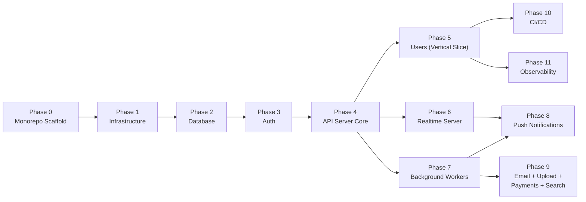

# iZimate v2 — Implementation Plan

> **Companion to [SYSTEM_DESIGN.md](./SYSTEM_DESIGN.md) and [IMPLEMENTATION_PATTERNS.md](./IMPLEMENTATION_PATTERNS.md)**
>
> This plan sequences every piece of the v2 architecture into buildable, verifiable phases. Each task has a clear deliverable and acceptance criteria. Phases are sequential — each builds on the previous — but tasks within a phase can often be parallelized.

---

## Guiding Principles

1. **Foundation before features.** Every phase builds infrastructure that all future features inherit.
2. **Verify each layer before moving up.** Each phase ends with a smoke test or integration check.
3. **One vertical slice early.** Phase 5 delivers a "Users" feature end-to-end (DB → API → client → mobile/web) to validate the entire stack before building more features.
4. **No premature optimization.** Start with single instances, free tiers, and simple configs. Harden later.

---

## Phase Overview

| Phase  | Name                                  | Goal                                                                | Depends On |
| ------ | ------------------------------------- | ------------------------------------------------------------------- | ---------- |
| **0**  | Monorepo Scaffold                     | Workspace structure, tooling, package skeletons                     | —          |
| **1**  | Infrastructure (IaC)                  | All AWS + third-party resources provisioned                         | Phase 0    |
| **2**  | Database Foundation                   | Neon connected, Drizzle configured, users table, migrations working | Phase 1    |
| **3**  | Auth                                  | Auth0 tenant, JWT verification, auth middleware                     | Phase 2    |
| **4**  | API Server Core                       | Fastify on Lambda serving authenticated routes                      | Phase 3    |
| **5**  | First Vertical Slice — Users          | End-to-end: DB → API → api-client → mobile + web                    | Phase 4    |
| **6**  | Realtime Server                       | Fargate + Socket.io + Redis adapter + SNS subscription              | Phase 4    |
| **7**  | Background Workers                    | SQS consumers (email + push), EventBridge cron, DLQs                | Phase 4    |
| **8**  | Push Notifications                    | Full push lifecycle: registration → delivery → receipt checking     | Phase 6, 7 |
| **9**  | Email, Image Upload, Payments, Search | Remaining infrastructure features                                   | Phase 7    |
| **10** | CI/CD Pipeline                        | Automated lint, test, build, deploy across all apps                 | Phase 5+   |
| **11** | Observability & Hardening             | Sentry, structured logging, correlation IDs, alerts                 | Phase 5+   |

**Estimated total:** ~12–16 weeks for a solo developer, ~6–8 weeks for two.

---

## Phase 0 — Monorepo Scaffold

**Goal:** Working pnpm workspace with all package skeletons, shared tooling, and TypeScript compilation.

| #    | Task                                  | Deliverable                                                            | Acceptance Criteria                                     |
| ---- | ------------------------------------- | ---------------------------------------------------------------------- | ------------------------------------------------------- |
| 0.1  | Initialize monorepo                   | `pnpm-workspace.yaml` with `apps/*` and `packages/*` globs             | `pnpm install` succeeds from root                       |
| 0.2  | Root tsconfig                         | `tsconfig.json` with project references                                | Base config extends to all packages                     |
| 0.3  | ESLint + Prettier                     | Root config, shared rules                                              | `pnpm lint` runs across all packages                    |
| 0.4  | Create `@izimate/shared` skeleton     | `packages/shared/` with `src/`, `package.json`, `tsconfig.json`        | Builds, exports from `src/index.ts`                     |
| 0.5  | Create `@izimate/db` skeleton         | `packages/db/` with `src/`, Drizzle config, `package.json`             | Builds, `drizzle-kit` CLI available                     |
| 0.6  | Create `@izimate/api-client` skeleton | `packages/api-client/` with `src/http/`, `src/socket/`, `package.json` | Builds, exports from `src/index.ts`                     |
| 0.7  | Create `apps/api` skeleton            | `apps/api/` with Fastify + `@fastify/aws-lambda`                       | `pnpm dev` starts local Fastify server                  |
| 0.8  | Create `apps/realtime` skeleton       | `apps/realtime/` with Fastify + Socket.io, `Dockerfile`                | `pnpm dev` starts local server, `docker build` succeeds |
| 0.9  | Create `apps/workers` skeleton        | `apps/workers/` with Lambda handler stubs                              | Builds, exports handler functions                       |
| 0.10 | Create `apps/mobile` skeleton         | `apps/mobile/` with Expo SDK 54, Expo Router v6                        | `npx expo start` launches dev server                    |
| 0.11 | Create `apps/web` skeleton            | `apps/web/` with Next.js 16, App Router                                | `pnpm dev` starts on localhost:3000                     |
| 0.12 | Create `infra/` skeleton              | `infra/` with Pulumi project, empty resource files                     | `pulumi preview` runs without error                     |
| 0.13 | Verify cross-package imports          | `apps/api` imports from `@izimate/shared` and `@izimate/db`            | TypeScript compiles, runtime imports work               |

**Verification:** Run `pnpm -r build` from root — all packages and apps compile without errors.

---

## Phase 1 — Infrastructure (Pulumi IaC)

**Goal:** All AWS resources provisioned and reachable. Third-party services (Auth0, Neon, R2, Resend, Stripe) have accounts and API keys.

### 1a. Third-Party Accounts

| #   | Task                        | Deliverable                                             | Acceptance Criteria                                            |
| --- | --------------------------- | ------------------------------------------------------- | -------------------------------------------------------------- |
| 1.1 | Create Neon project         | Neon project with `main` branch, connection string      | Can connect via `@neondatabase/serverless` from a local script |
| 1.2 | Create Auth0 tenant         | Tenant, API audience, SPA + native application configs  | Auth0 dashboard shows apps, login page loads                   |
| 1.3 | Create Cloudflare R2 bucket | R2 bucket with public access for CDN                    | Can upload + read a test file via S3 SDK                       |
| 1.4 | Create Resend account       | API key, verified sending domain                        | Test email sends successfully                                  |
| 1.5 | Create Stripe account       | Secret key, webhook signing secret                      | Test mode dashboard accessible                                 |
| 1.6 | Create Sentry projects      | Sentry projects for mobile, web, api, realtime, workers | DSNs available for each project                                |

### 1b. AWS Infrastructure (Pulumi)

| #    | Task                        | Deliverable                                                                   | Acceptance Criteria                                                   |
| ---- | --------------------------- | ----------------------------------------------------------------------------- | --------------------------------------------------------------------- |
| 1.7  | S3 backend for Pulumi state | S3 bucket + DynamoDB lock table                                               | `pulumi login s3://...` succeeds                                      |
| 1.8  | VPC + subnets               | VPC `10.0.0.0/16`, 2 public subnets, 1 private subnet                         | `pulumi up` creates resources, subnets visible in console             |
| 1.9  | ElastiCache Redis           | `t4g.micro` in private subnet, security group                                 | Can connect from within VPC (test from Fargate later)                 |
| 1.10 | API Gateway HTTP API        | HTTP API with `$default` stage, custom domain `api.izimate.com`               | HTTPS request to `api.izimate.com` returns 404 (no Lambda yet)        |
| 1.11 | Lambda — API function       | Node.js 22, arm64, 512 MB, 30s timeout, API Gateway integration               | Deploys hello-world handler, API Gateway routes to it                 |
| 1.12 | Lambda — Worker functions   | Email + push workers, 60s timeout                                             | Deploy stubs, SQS triggers configured                                 |
| 1.13 | Lambda — Cron functions     | Push-receipts (15 min) + cleanup (daily)                                      | EventBridge schedules visible, Lambda stubs deploy                    |
| 1.14 | SQS queues                  | `email` + `push` queues, each with a DLQ (3 retries, 14-day retention)        | Queues visible in console, test message round-trips                   |
| 1.15 | SNS Events Topic            | Topic with HTTPS subscription to ALB                                          | Topic created, subscription pending (confirmed after Fargate deploys) |
| 1.16 | ALB                         | HTTPS listener, target group for Fargate, sticky sessions, 3600s idle timeout | ALB healthy, domain `realtime.izimate.com` resolves                   |
| 1.17 | ECS Fargate service         | Task definition (0.5 vCPU, 1 GB), ECR repo, desired count = 1                 | Fargate task runs, ALB health check passes                            |
| 1.18 | ACM certificates            | Certs for `api.izimate.com` and `realtime.izimate.com`                        | Certificates validated and attached to API Gateway + ALB              |
| 1.19 | DNS records                 | Route53 or Cloudflare: `api.`, `realtime.`, `www.` + apex                     | All subdomains resolve to correct targets                             |
| 1.20 | SSM parameters              | Stripe keys stored as SecureString                                            | `aws ssm get-parameter` returns encrypted values                      |
| 1.21 | CloudWatch DLQ alarms       | Alarm on each DLQ (`ApproximateNumberOfMessagesVisible > 0`)                  | Test message to DLQ triggers alarm                                    |

**Verification:** `pulumi up` provisions everything. Lambda returns "hello" at `api.izimate.com/health`. Fargate returns "ok" at `realtime.izimate.com/health`. SNS subscription confirmed.

---

## Phase 2 — Database Foundation

**Goal:** Neon connected from Lambda and Fargate. Drizzle schema for `users` table. Migration workflow working.

| #   | Task                               | Deliverable                                                                                   | Acceptance Criteria                                                    |
| --- | ---------------------------------- | --------------------------------------------------------------------------------------------- | ---------------------------------------------------------------------- |
| 2.1 | Configure Drizzle in `@izimate/db` | `drizzle.config.ts` with Neon HTTP driver                                                     | `drizzle-kit push` connects to Neon                                    |
| 2.2 | Define `users` table schema        | `packages/db/src/schema/users.ts` — id, auth0Id, email, name, avatarUrl, isOnline, timestamps | Schema file compiles, types exported                                   |
| 2.3 | Generate + apply first migration   | `drizzle/` migration files                                                                    | `drizzle-kit generate` creates SQL, `drizzle-kit push` applies to Neon |
| 2.4 | Export DB client + schema          | `packages/db/src/index.ts` exports `db`, `users`, types                                       | `apps/api` can import and query                                        |
| 2.5 | Neon branching setup               | Branch per environment (dev, staging)                                                         | `drizzle-kit push` works against a Neon branch                         |
| 2.6 | Verify from Lambda                 | Deploy API Lambda that queries `SELECT 1` via Drizzle                                         | `api.izimate.com/health` returns `{ "db": "ok" }`                      |
| 2.7 | Verify from Fargate                | Fargate health check queries Neon                                                             | `realtime.izimate.com/health` returns `{ "db": "ok" }`                 |

**Verification:** Both Lambda and Fargate can read/write to Neon. Migration workflow creates + applies schema changes.

---

## Phase 3 — Auth

**Goal:** Auth0 login working on mobile + web. JWT verification on all server-side services. `authPlugin` protecting API routes.

| #   | Task                               | Deliverable                                                                | Acceptance Criteria                                                     |
| --- | ---------------------------------- | -------------------------------------------------------------------------- | ----------------------------------------------------------------------- |
| 3.1 | Implement `verifyToken()`          | `packages/db/src/auth.ts` — jose JWKS verification                         | Unit test: valid Auth0 JWT returns payload; invalid JWT throws          |
| 3.2 | Implement Fastify `authPlugin`     | `apps/api/src/middleware/auth.ts` — decorates `req.userId`                 | Protected route returns 401 without token, 200 with valid token         |
| 3.3 | Auth0 — configure social providers | Google, Apple Sign-In enabled in Auth0 dashboard                           | Social login flows work in Auth0 Universal Login                        |
| 3.4 | Mobile — Auth0 login flow          | `expo-auth-session` + `expo-secure-store`                                  | User can sign in, JWT stored in secure store, displayed in debug screen |
| 3.5 | Mobile — token attachment          | `Authorization: Bearer` header on all API calls                            | API receives valid JWT from mobile app                                  |
| 3.6 | Web — Auth0 SDK setup              | Next.js Auth0 SDK, `/api/auth/*` route handlers                            | User can sign in via browser, session cookie set                        |
| 3.7 | Web — token forwarding             | Extract token from session, add to `api-client` calls                      | API receives valid JWT from web app                                     |
| 3.8 | Socket.io auth middleware          | JWT verification in `connection` handler                                   | Socket connects with valid token, rejects without                       |
| 3.9 | User upsert on first login         | API route: on first authenticated request, create user in DB if not exists | New Auth0 user gets a `users` row; returning user gets existing row     |

**Verification:** Mobile app and web app can sign in → JWT is verified by API → user exists in DB. Socket.io connection authenticated.

---

## Phase 4 — API Server Core

**Goal:** Fastify on Lambda with all middleware, error handling, and the standard route pattern established.

| #    | Task                                     | Deliverable                                                             | Acceptance Criteria                                                                                                 |
| ---- | ---------------------------------------- | ----------------------------------------------------------------------- | ------------------------------------------------------------------------------------------------------------------- |
| 4.1  | Fastify bootstrap with Zod type provider | `apps/api/src/index.ts` — full setup per IMPLEMENTATION_PATTERNS.md § 2 | Local dev server starts, Lambda handler exported                                                                    |
| 4.2  | CORS plugin                              | `@fastify/cors` configured for `izimate.com` + `localhost:*`            | Preflight requests pass from allowed origins, rejected from others                                                  |
| 4.3  | Rate limiting plugin                     | `@fastify/rate-limit` — global defaults + per-route overrides           | 429 returned after exceeding limit; `Retry-After` header present                                                    |
| 4.4  | Standard error handler                   | `setErrorHandler` plugin, consistent JSON error shape (Section 21)      | Zod validation fails → 400 with field details; 404 returns standard shape; unknown error → 500 with generic message |
| 4.5  | Health check endpoint                    | `GET /health` returns DB status                                         | Returns `{ "status": "ok", "db": "connected" }`                                                                     |
| 4.6  | Webhook route skeleton                   | `POST /webhooks/stripe` with Stripe signature verification              | Valid Stripe test webhook → 200; tampered signature → 400                                                           |
| 4.7  | Lambda deploy + test                     | Deploy bundled app via Pulumi/GitHub Actions                            | `api.izimate.com/health` returns 200                                                                                |
| 4.8  | Define `AppEvent` type                   | `@izimate/shared` — `{ type, namespace, room, data }`                   | Shared type used by `publishEvent()` and Fargate internal endpoint                                                  |
| 4.9  | Implement `publishEvent()`               | `packages/db/src/events.ts` — SNS PublishCommand wrapper                | Unit test: publishes typed event to SNS topic                                                                       |
| 4.10 | Implement `queueEmail()` + `queuePush()` | `packages/db/src/queue.ts` — SQS SendMessage wrappers                   | Unit test: sends typed messages to correct SQS queues                                                               |

**Verification:** API serves routes on Lambda behind API Gateway. Auth middleware protects routes. Error handler returns consistent shapes. SNS + SQS helpers work.

---

## Phase 5 — First Vertical Slice (Users)

**Goal:** Prove the entire stack end-to-end by building the first feature — user profiles — from DB to client.

This is the most important phase. It validates every architectural decision in the system design before building more features.

| #   | Task                         | Deliverable                                                                       | Acceptance Criteria                                                    |
| --- | ---------------------------- | --------------------------------------------------------------------------------- | ---------------------------------------------------------------------- |
| 5.1 | Zod schemas for user profile | `@izimate/shared` — `UserSchema`, `UpdateUserSchema`                              | Schemas compile, used by both API and client                           |
| 5.2 | User API routes              | `apps/api/src/routes/users.ts` — `GET /api/users/me`, `PATCH /api/users/me`       | Authenticated request returns user profile; update changes name/avatar |
| 5.3 | Typed client functions       | `packages/api-client/src/http/users.ts` — `usersApi.getMe()`, `usersApi.update()` | Functions return typed `User` objects                                  |
| 5.4 | Mobile — profile screen      | `apps/mobile/src/app/(tabs)/profile.tsx` — fetch + display user data              | Screen shows user name, email, avatar from API                         |
| 5.5 | Mobile — edit profile        | Edit form that calls `usersApi.update()`                                          | User can change name, changes persist across app restart               |
| 5.6 | Web — profile page           | `apps/web/app/profile/page.tsx` — fetch + display user data                       | Page renders user profile from API                                     |
| 5.7 | React Query setup            | `QueryClient` configured in both mobile + web, `useQuery` for user data           | Data cached, refetches on focus, loading/error states work             |
| 5.8 | Zustand user store           | `apps/mobile/src/stores/user.ts` — auth state, current user                       | Auth token + user data persisted and accessible globally               |
| 5.9 | End-to-end test              | Sign in → view profile → edit → verify change in DB                               | Full round-trip works on both mobile (Maestro) and web (Playwright)    |

**Verification:** A user can sign in on mobile or web, see their profile, edit it, and see the change reflected. The type chain works end-to-end: Zod schema → API validation → api-client return type → React component props. **If this phase works, every future feature follows the same pattern.**

---

## Phase 6 — Realtime Server

**Goal:** Fargate running Socket.io with Redis adapter, SNS subscription, namespaces, and presence.

| #    | Task                                     | Deliverable                                                                              | Acceptance Criteria                                           |
| ---- | ---------------------------------------- | ---------------------------------------------------------------------------------------- | ------------------------------------------------------------- |
| 6.1  | Fastify + Socket.io bootstrap            | `apps/realtime/src/index.ts` — server with health check                                  | Local dev: Socket.io serves at `ws://localhost:3001`          |
| 6.2  | Redis pub/sub adapter                    | `@socket.io/redis-adapter` connected to ElastiCache                                      | Two local instances broadcast messages between them           |
| 6.3  | JWT auth middleware                      | Socket.io `connection` handler verifies token, decorates `socket.data.userId`            | Connection rejected without valid token                       |
| 6.4  | SNS internal endpoint                    | `POST /internal/events` — subscription confirmation + event forwarding                   | SNS test publish → event emitted to correct Socket.io room    |
| 6.5  | `/presence` namespace                    | `user:online`, `user:offline` events; `is_online` flag in Neon                           | Connect → user appears online; disconnect → offline           |
| 6.6  | `/notifications` namespace               | `notification:new`, `notification:read` events                                           | SNS event → notification delivered to connected user's room   |
| 6.7  | `/chat` namespace                        | `message:send`, `message:read`, `typing:start`, `typing:stop`                            | Two clients in same room see messages in real time            |
| 6.8  | Dockerfile + ECR push                    | Multi-stage Docker build                                                                 | `docker build` succeeds, image pushes to ECR                  |
| 6.9  | Deploy to Fargate                        | ECS service update, ALB health check passes                                              | `realtime.izimate.com/health` returns 200                     |
| 6.10 | SNS subscription confirmation            | Fargate confirms HTTPS subscription from SNS                                             | SNS subscription status = "Confirmed" in AWS console          |
| 6.11 | Socket.io client hooks                   | `packages/api-client/src/socket/` — `useSocket()`, `usePresence()`, `useNotifications()` | Mobile + web can connect, receive events via typed hooks      |
| 6.12 | Mobile — realtime connection             | Socket.io connects on app launch with JWT                                                | Connection established on login, disconnects on logout        |
| 6.13 | Web — realtime connection                | Socket.io connects after auth                                                            | Same as mobile                                                |
| 6.14 | Integration test: SNS → Fargate → Client | API publishes event → SNS → Fargate → client receives                                    | Client app receives realtime event within ~50ms of API action |

**Verification:** Client connects to Socket.io via ALB. Presence updates flow. API publishes an SNS event → client receives it in real time.

---

## Phase 7 — Background Workers

**Goal:** SQS consumers for email + push operational. EventBridge cron functions running. DLQ monitoring active.

| #   | Task                   | Deliverable                                                         | Acceptance Criteria                                                 |
| --- | ---------------------- | ------------------------------------------------------------------- | ------------------------------------------------------------------- |
| 7.1 | Email worker           | `apps/workers/src/email.ts` — SQS consumer → Resend API             | Test `queueEmail()` → worker sends email via Resend                 |
| 7.2 | React Email templates  | Base template + first transactional template (welcome email)        | Template renders correctly, sent via Resend                         |
| 7.3 | Push worker            | `apps/workers/src/push.ts` — SQS consumer → Expo Push API           | Test `queuePush()` → worker sends push via Expo SDK                 |
| 7.4 | Push receipts cron     | `apps/workers/src/cron/push-receipts.ts` — EventBridge every 15 min | Unprocessed tickets checked, invalid tokens purged                  |
| 7.5 | Cleanup cron           | `apps/workers/src/cron/cleanup.ts` — EventBridge daily              | Stale records deactivated, expired data purged                      |
| 7.6 | DLQ alarm verification | Send a poison message → verify DLQ alarm fires                      | CloudWatch alarm → Slack notification                               |
| 7.7 | Worker deploy          | All Lambda workers deployed via Pulumi                              | Workers running, SQS triggers active, EventBridge schedules visible |

**Verification:** `queueEmail("test@example.com", "welcome", {})` → email arrives. `queuePush(userId, "Test", "Hello")` → push notification received on device. DLQ alarm fires for failed messages.

---

## Phase 8 — Push Notifications (Full Lifecycle)

**Goal:** Complete push notification system from client registration through delivery and receipt checking.

**Depends on:** Phase 6 (presence — `is_online` flag) + Phase 7 (push worker + receipt cron).

| #   | Task                              | Deliverable                                                    | Acceptance Criteria                                                |
| --- | --------------------------------- | -------------------------------------------------------------- | ------------------------------------------------------------------ |
| 8.1 | `push_tokens` table               | Drizzle schema + migration — per-device token storage          | Table exists, FK to users with CASCADE delete                      |
| 8.2 | `push_receipts` table             | Drizzle schema + migration — ticket tracking                   | Table exists, `processed` flag defaults to false                   |
| 8.3 | Push token API endpoint           | `POST /api/users/push-token` — upsert token                    | Mobile sends token → upserted in DB; duplicate → updated timestamp |
| 8.4 | Mobile — expo-notifications setup | Permission request, token registration on app launch           | Permission granted → token sent to API → stored in DB              |
| 8.5 | Notification handler config       | Foreground notification display settings                       | Notification shows alert, plays sound when app is in foreground    |
| 8.6 | Online/offline gating             | Push worker checks `is_online` flag before sending             | Online user → no push (realtime only). Offline user → push sent.   |
| 8.7 | Deep linking payload              | Push data payload routes to correct screen on tap              | Tap notification → app opens to relevant screen                    |
| 8.8 | Receipt checking integration      | Cron verifies delivery, purges invalid tokens                  | `DeviceNotRegistered` tokens removed from `push_tokens` table      |
| 8.9 | End-to-end test                   | Trigger event → user offline → push received → tap → deep link | Full lifecycle works                                               |

**Verification:** User logs out (offline). Another action triggers a push. User's device receives notification. Tap opens to the correct screen. Invalid tokens are cleaned up by the receipt cron.

---

## Phase 9 — Email, Image Upload, Payments, Search

**Goal:** Remaining infrastructure features that most domain features will need.

### 9a. Email (Resend)

| #   | Task                           | Deliverable                                                  | Acceptance Criteria                       |
| --- | ------------------------------ | ------------------------------------------------------------ | ----------------------------------------- |
| 9.1 | Email template system          | React Email base layout + re-usable components               | Templates render correct HTML             |
| 9.2 | Welcome email                  | Sent on user registration (triggered from user upsert route) | New user signs up → welcome email arrives |
| 9.3 | Email sending integration test | `queueEmail()` → SQS → worker → Resend → inbox               | Email arrives with correct template data  |

### 9b. Image Upload (Cloudflare R2)

| #   | Task                           | Deliverable                                                     | Acceptance Criteria                                    |
| --- | ------------------------------ | --------------------------------------------------------------- | ------------------------------------------------------ |
| 9.4 | Presigned URL endpoint         | `POST /api/uploads/presign` — returns PUT URL with 15min expiry | Client receives a working presigned URL                |
| 9.5 | Mobile — image picker + upload | Select/take photo → direct upload to R2 via presigned URL       | Image appears in R2 bucket                             |
| 9.6 | Web — file upload              | File picker → direct upload to R2                               | Same as mobile                                         |
| 9.7 | Image optimization             | Cloudflare Image Transformations via URL params                 | `?width=400&format=webp` returns optimized image       |
| 9.8 | Avatar upload integration      | Profile edit → upload avatar → store R2 key on user             | User's avatar URL updates, optimized image shows in UI |

### 9c. Payments (Stripe)

| #    | Task                    | Deliverable                                                         | Acceptance Criteria                                                          |
| ---- | ----------------------- | ------------------------------------------------------------------- | ---------------------------------------------------------------------------- |
| 9.9  | Stripe checkout session | `POST /api/payments/checkout` → Stripe Checkout URL                 | Client redirected to Stripe hosted payment page                              |
| 9.10 | Stripe webhook handler  | `POST /webhooks/stripe` — signature verification + event processing | Test webhook from Stripe CLI → DB updated, email queued, SNS event published |
| 9.11 | Stripe Connect setup    | Provider onboarding + payout configuration                          | Provider connects Stripe account, receives test payout                       |
| 9.12 | Payment status realtime | Webhook → SNS → Fargate → client notified                           | Client sees payment confirmation in real time                                |

### 9d. Search (Postgres Full-Text)

| #    | Task                    | Deliverable                                                  | Acceptance Criteria                               |
| ---- | ----------------------- | ------------------------------------------------------------ | ------------------------------------------------- |
| 9.13 | Full-text search helper | Drizzle query with `tsvector`/`tsquery` + `ts_rank` ordering | Search returns ranked results                     |
| 9.14 | Search API endpoint     | `GET /api/search?q=...`                                      | Returns paginated, ranked results                 |
| 9.15 | Client search hooks     | `api-client` search function + React Query integration       | Mobile + web search UI works with debounced input |

**Verification:** Each sub-feature works independently. Email sends, images upload and display, payments process, search returns results.

---

## Phase 10 — CI/CD Pipeline

**Goal:** Every PR is linted, type-checked, and tested. Merges to main trigger automated deploys.

| #     | Task                         | Deliverable                                                              | Acceptance Criteria                                      |
| ----- | ---------------------------- | ------------------------------------------------------------------------ | -------------------------------------------------------- |
| 10.1  | GitHub Actions — PR checks   | Workflow: `pnpm lint`, `pnpm typecheck`, `pnpm test`                     | PR blocked if lint/types/tests fail                      |
| 10.2  | Vitest setup                 | Unit test config for `apps/api`, `packages/shared`, `packages/db`        | `pnpm test` runs all tests, coverage reported            |
| 10.3  | Vercel preview deploys       | Web app deploys preview on every PR                                      | PR gets a preview URL comment                            |
| 10.4  | Neon branch per PR           | Auto-create Neon branch on PR open, delete on merge                      | Preview deployment connects to isolated DB branch        |
| 10.5  | Lambda deploy workflow       | GH Action: esbuild → `aws lambda update-function-code` on merge to main  | API + workers deploy on merge, smoke test passes         |
| 10.6  | Fargate deploy workflow      | GH Action: build Docker → push ECR → update ECS service on merge to main | New Fargate task rolls out, health check passes          |
| 10.7  | Pulumi IaC workflow          | GH Action: `pulumi up` on merge to main (only when `infra/` changes)     | Infrastructure changes applied automatically             |
| 10.8  | EAS Build configuration      | `eas.json` with development, preview, production profiles                | `eas build --profile preview` produces installable build |
| 10.9  | E2E tests — Playwright (web) | Playwright config + first test suite (auth + profile flows)              | `pnpm test:e2e` runs headlessly in CI                    |
| 10.10 | E2E tests — Maestro (mobile) | Maestro flows for auth + profile                                         | Maestro runs against dev build                           |

**Verification:** Open a PR → checks run → preview deploys. Merge → Lambda + Fargate + web deploy automatically.

---

## Phase 11 — Observability & Hardening

**Goal:** Errors are caught, logs are structured, failures are alerted on. Production readiness.

| #     | Task                      | Deliverable                                                            | Acceptance Criteria                                                          |
| ----- | ------------------------- | ---------------------------------------------------------------------- | ---------------------------------------------------------------------------- |
| 11.1  | Sentry — Lambda           | `@sentry/aws-serverless` in API + workers                              | Thrown error → Sentry event with context                                     |
| 11.2  | Sentry — Fargate          | `@sentry/node` in realtime server                                      | Thrown error → Sentry event                                                  |
| 11.3  | Sentry — Mobile           | `@sentry/react-native` with Expo plugin                                | Crash → Sentry event with device info and stack trace                        |
| 11.4  | Sentry — Web              | `@sentry/nextjs`                                                       | Client + server errors → Sentry events                                       |
| 11.5  | Structured JSON logging   | Pino logger configured in all server-side services                     | Logs output valid JSON with `level`, `timestamp`, `service`, `correlationId` |
| 11.6  | Correlation ID middleware | API generates/forwards `X-Correlation-ID`; propagated to SQS + SNS     | Single user action traceable across API → SQS → worker → SNS → Fargate       |
| 11.7  | CloudWatch alarms         | Alarms for: Lambda error rate > 5%, P99 > 5s, Fargate unhealthy        | Alarms fire correctly when conditions are simulated                          |
| 11.8  | Slack alerting            | CloudWatch alarms + Sentry alerts → Slack channel                      | Alert appears in Slack within 1 minute of trigger                            |
| 11.9  | Health check hardening    | All `/health` endpoints check their dependencies (DB, Redis, external) | Health endpoint returns detailed status with component checks                |
| 11.10 | Request logging           | API logs every request: method, path, status, duration, userId         | Structured logs queryable in CloudWatch Logs Insights                        |

**Verification:** Trigger a deliberate error → Sentry captures it → Slack alert fires. Trace a request end-to-end via correlation ID in CloudWatch.

---

## Task Dependency Graph

**Critical path:** P0 → P1 → P2 → P3 → P4 → P5 (first usable feature)

**Parallelizable after Phase 4:** Phases 5, 6, and 7 can be worked on simultaneously once the API server core is complete.

---

## Milestone Checkpoints

| Milestone                    | After Phase | What You Can Demo                                                                                |
| ---------------------------- | ----------- | ------------------------------------------------------------------------------------------------ |
| **M1 — Foundation**          | Phase 2     | Monorepo builds. Lambda + Fargate deployed. DB connected.                                        |
| **M2 — Auth Works**          | Phase 3     | User signs in on mobile + web. JWT verified by API.                                              |
| **M3 — First Feature**       | Phase 5     | Full vertical slice: sign in → view profile → edit → see changes. Validates entire architecture. |
| **M4 — Realtime**            | Phase 6     | Client receives events in real time. Presence works.                                             |
| **M5 — Workers**             | Phase 7     | Email sends. Push delivers. Cron runs. DLQ alerts fire.                                          |
| **M6 — Full Infrastructure** | Phase 9     | All infrastructure features operational. Platform ready for domain features.                     |
| **M7 — Production Ready**    | Phase 11    | CI/CD automated. Errors tracked. Logs structured. Alerts working.                                |

---

## After This Plan: Building Features

Once all phases are complete, the platform foundation is ready. Every new domain feature (service listings, bookings, reviews, etc.) follows the **Section 23 contract** from SYSTEM_DESIGN.md:

1. Define Zod schemas in `@izimate/shared`
2. Add Drizzle table in `@izimate/db`
3. Add API route in `apps/api`
4. Add typed client in `@izimate/api-client`
5. (If realtime) Add Socket.io events in `apps/realtime`
6. (If async) Use `queueEmail()` / `queuePush()`
7. (If scheduled) Add EventBridge cron Lambda

No new infrastructure. No new patterns. Just domain logic on top of the foundation.
