# iZimate v2 — System Design

## 1. Architecture Overview

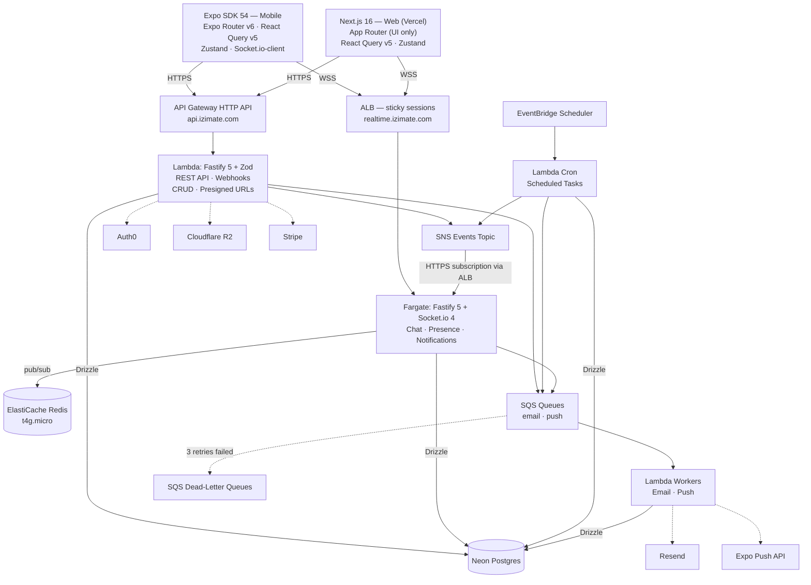

---

## 2. Technology Stack

| Layer | Choice | Rationale |
|-------|--------|-----------|
| **Mobile** | Expo SDK 54 + Expo Router v6 | Proven cross-platform framework |
| **Web** | Next.js 16 App Router (Vercel) | SSR/SSG, UI only — no data API routes (Auth0 route handler only) |
| **API** | Fastify 5 + Zod on AWS Lambda (API Gateway HTTP API) | Single API for both clients, same framework as realtime |
| **Realtime** | Fastify 5 + Socket.io 4 (ECS Fargate) | Persistent WebSockets, rooms, presence |
| **Async workers** | Lambda + SQS | Email, push notifications, webhook side-effects |
| **Scheduled jobs** | Lambda + EventBridge Scheduler | Scheduled tasks: expiration, reminders, cleanup |
| **Database** | Neon Serverless Postgres + Drizzle ORM | Scale-to-zero, branching, type-safe queries |
| **Cache / Pub-Sub** | ElastiCache Redis (t4g.micro) | Sub-ms pub/sub for Socket.io adapter |
| **Auth** | Auth0 | 25k MAU free, social login, standard JWTs |
| **Storage** | Cloudflare R2 | Free egress, S3-compatible, built-in CDN |
| **Payments** | Stripe | Checkout sessions, Connect payouts, webhooks |
| **Email** | Resend | Transactional emails |
| **Push notifications** | Expo Push API | Called server-side from Lambda workers |
| **Monitoring** | Sentry | Error tracking across mobile, web, and server |
| **Validation** | Zod | Shared schemas between client + server |
| **Client state** | React Query (server state) + Zustand (client state) | Minimal, proven |
| **IaC** | Pulumi (TypeScript) | Infrastructure as code in the same language as the app; state stored in S3 |
| **Monorepo** | pnpm workspaces | Same as current, proven |

---

## 3. Monorepo Structure

```
izimate-v2/
├── apps/
│   ├── mobile/                 # Expo React Native app
│   │   ├── src/
│   │   │   ├── app/            # Expo Router screens
│   │   │   ├── components/     # UI components
│   │   │   ├── hooks/          # ~40-50 consolidated hooks
│   │   │   ├── stores/         # Zustand (user, ui)
│   │   │   └── lib/            # Utils, config, constants
│   │   └── package.json
│   │
│   ├── web/                    # Next.js 16 — UI only, NO data/business API routes
│   │   ├── app/                # App Router pages + Auth0 route handler
│   │   │   └── api/auth/       # Auth0 session only (login, callback, logout)
│   │   ├── components/         # Web UI components
│   │   ├── hooks/              # Web-specific hooks
│   │   ├── lib/                # Utils, auth middleware
│   │   └── package.json
│   │
│   ├── api/                    # Fastify REST API → deployed to Lambda
│   │   ├── src/
│   │   │   ├── routes/         # Route modules
│   │   │   ├── middleware/     # Auth (JWT verify), CORS, rate limiting
│   │   │   ├── services/      # Business logic
│   │   │   └── index.ts       # Fastify app + Lambda adapter
│   │   ├── package.json
│   │   └── tsconfig.json
│   │
│   ├── realtime/               # Fastify + Socket.io → deployed to Fargate
│   │   ├── src/
│   │   │   ├── namespaces/     # Application-defined namespaces
│   │   │   ├── handlers/       # Event handlers per namespace
│   │   │   ├── middleware/     # Auth (JWT verify), rate limiting
│   │   │   ├── internal/      # POST /internal/events (SNS HTTPS subscription)
│   │   │   └── index.ts       # Fastify + Socket.io bootstrap
│   │   ├── Dockerfile
│   │   └── package.json
│   │
│   └── workers/                # Lambda workers → async side-effects
│       ├── src/
│       │   ├── email.ts        # SQS consumer → Resend
│       │   ├── push.ts         # SQS consumer → Expo Push API
│       │   ├── cron/           # EventBridge-triggered scheduled jobs
│       │   │   ├── push-receipts.ts      # Check Expo push receipts → every 15 min
│       │   │   └── cleanup.ts            # Purge stale data → daily
│       │   └── index.ts
│       ├── package.json
│       └── tsconfig.json
│
├── packages/
│   ├── shared/                 # Isomorphic TS — no server-only dependencies
│   │   ├── src/
│   │   │   ├── types/          # Domain types
│   │   │   ├── schemas/        # Zod validation schemas
│   │   │   ├── design/         # Design tokens (colors, spacing, typography)
│   │   │   ├── utils/          # Currency, date, price formatting
│   │   │   └── constants/      # Enums, status codes
│   │   └── package.json
│   │
│   ├── api-client/             # Typed HTTP + Socket.io hooks
│   │   ├── src/                # Used by BOTH mobile and web
│   │   │   ├── http/           # Typed fetch → api.izimate.com (Zod-typed)
│   │   │   ├── socket/         # Socket.io hooks → realtime.izimate.com
│   │   │   └── index.ts
│   │   └── package.json
│   │
│   └── db/                     # Drizzle schema + migrations + server utils
│       ├── src/                # Used by API Lambda + realtime + workers
│       │   ├── schema/         # Table definitions (single source of truth)
│       │   ├── auth.ts         # verifyToken() — jose JWKS (server-side only)
│       │   ├── events.ts       # publishEvent() — SNS helper (server-side only)
│       │   ├── queue.ts        # queueEmail(), queuePush() — SQS helpers
│       │   └── index.ts
│       ├── drizzle/            # Generated migration files
│       └── package.json
│
├── infra/                      # Pulumi IaC (TypeScript, state in S3)
│   ├── Pulumi.yaml             # Project definition
│   ├── Pulumi.prod.yaml        # Production stack config
│   ├── Pulumi.staging.yaml     # Staging stack config
│   ├── index.ts                # Entry point — composes all resources
│   ├── api-gateway.ts          # HTTP API + Lambda integration
│   ├── lambda.ts               # API + worker functions
│   ├── sqs.ts                  # Email + push queues
│   ├── sns.ts                  # Events topic + Fargate HTTPS subscription
│   ├── eventbridge.ts          # Cron schedules
│   ├── fargate.ts              # Socket.io service
│   ├── elasticache.ts          # Redis
│   ├── alb.ts                  # WebSocket load balancer
│   └── vpc.ts                  # Network layout
│
├── pnpm-workspace.yaml
├── package.json
└── tsconfig.json
```

---

## 4. Data Flow

### 4a. HTTP Requests (CRUD)

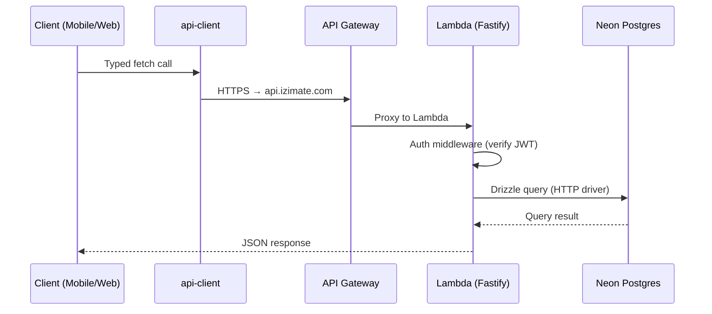

Single path. One API. Both clients.

### 4b. Realtime (Chat, Presence)

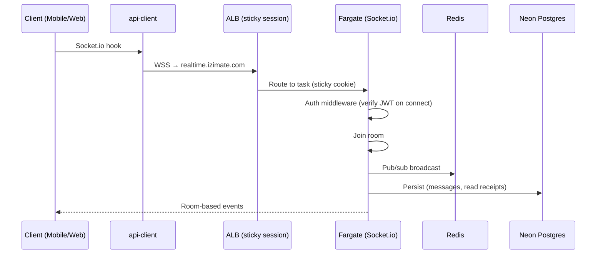

### 4c. Event Bus (SNS → Fargate)

When an API action or cron job needs to push a realtime event to connected clients:

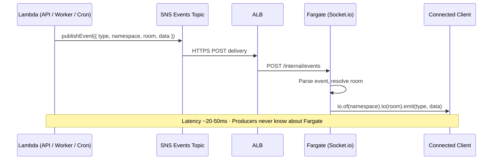

Future consumers (analytics, audit log) can subscribe to the same SNS topic as additional SQS queues — no producer code changes needed:

```
SNS Events Topic
  ├── HTTPS → ALB → Fargate          (existing — realtime)
  ├── SQS → Lambda audit-writer       (future — durable, DLQ)
  └── SQS → Lambda analytics-pipeline (future — durable, DLQ)
```

> **Note:** The email and push SQS queues (Section 10) are **not** subscribed to SNS. They receive messages directly via `queueEmail()` / `queuePush()` because their payloads are fundamentally different from realtime events. SNS carries `{ type, namespace, room, data }` for Socket.io — email and push need their own specific shapes.

### 4d. Async Side-Effects (Email, Push)

When an API action triggers a non-blocking side-effect:

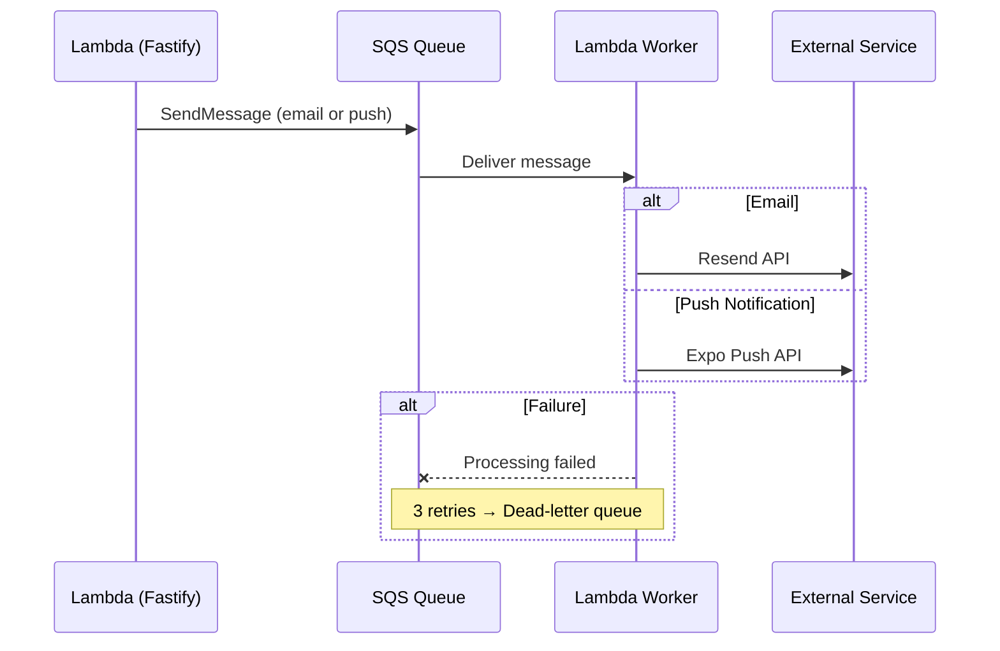

### 4e. Payments

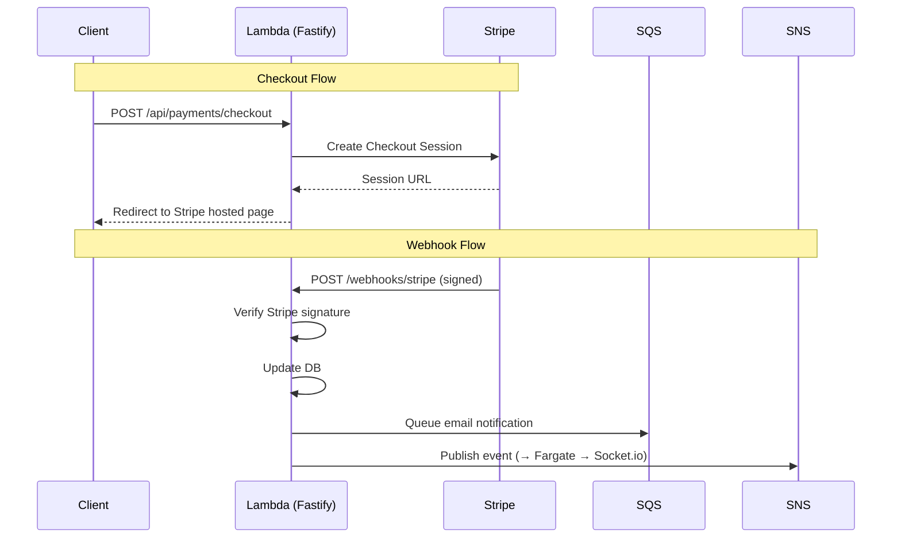

### 4f. Image Upload

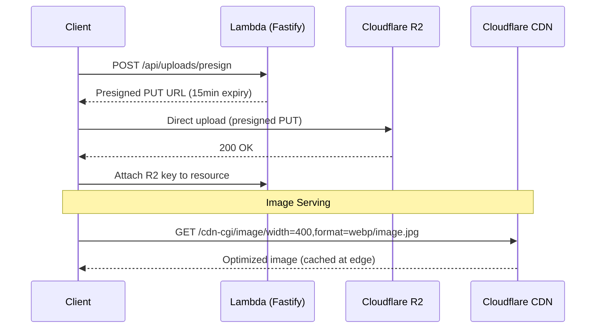

### 4g. Scheduled Jobs

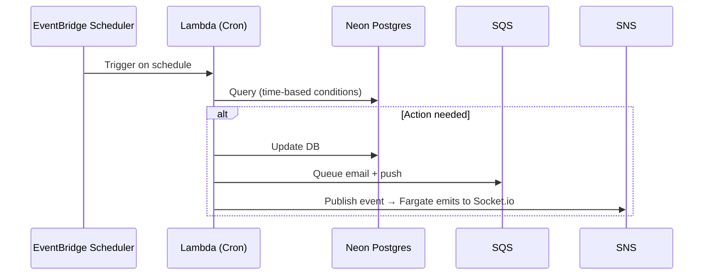

---

## 5. Networking & Infrastructure

### Compute Layout

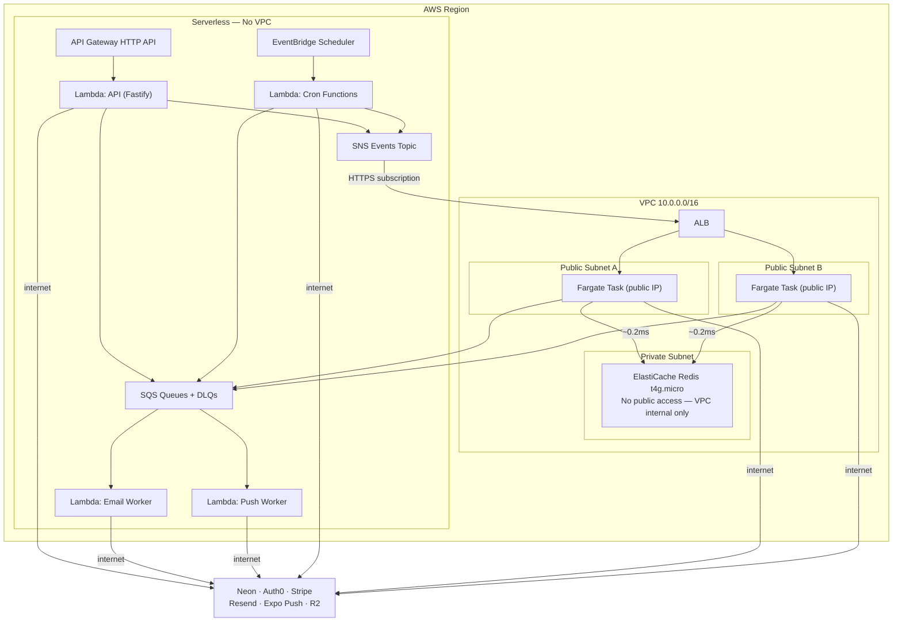

**Lambda runs OUTSIDE the VPC.** This is critical:
- Lambda needs to reach Neon, Auth0, Stripe, Resend, Expo Push, R2 — all on the public internet
- Lambda in a VPC requires a **NAT Gateway** (~$32/mo + data charges) for outbound internet
- Lambda outside VPC has free, instant internet access with zero cold-start penalty
- Lambda does NOT need ElastiCache — only Fargate needs Redis (for Socket.io pub/sub)

**Fargate stays in public subnets** (same as before):
- Auto-assigned public IPs for outbound internet (no NAT Gateway needed)
- Security group restricts inbound to ALB only
- Reaches ElastiCache over VPC internal networking (~0.2ms)

### API Gateway Configuration

| Setting | Value |
|---------|-------|
| **Type** | HTTP API (not REST API — 70% cheaper) |
| **Protocol** | HTTPS only |
| **Stage** | `$default` (auto-deploy) |
| **CORS** | Configured for `izimate.com` + `localhost:*` |
| **Throttle** | 1,000 req/sec burst, 500 sustained (adjustable) |
| **Custom domain** | `api.izimate.com` (ACM certificate) |
| **Integration** | Lambda proxy (single function, Fastify routes internally) |

### ALB Configuration

| Setting | Value |
|---------|-------|
| **Listeners** | HTTPS :443 (TLS termination) |
| **Target group** | Fargate tasks, port 3001 |
| **Health check** | `GET /health` on Fastify |
| **Sticky sessions** | Enabled, AWSALB cookie, 1-day duration |
| **WebSocket** | Natively supported (connection stays on same target after upgrade) |
| **Idle timeout** | 3600s (WebSocket connections are long-lived) |

### DNS

| Subdomain | Target |
|-----------|--------|
| `izimate.com` / `www.izimate.com` | Vercel (Next.js web — UI only) |
| `api.izimate.com` | API Gateway → Lambda (Fastify) |
| `realtime.izimate.com` | ALB → Fargate (Socket.io) |

---

## 6. Auth Flow

### Mobile (Expo)

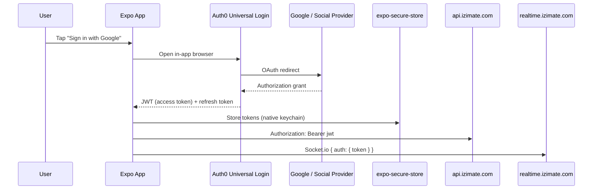

### Web (Next.js)

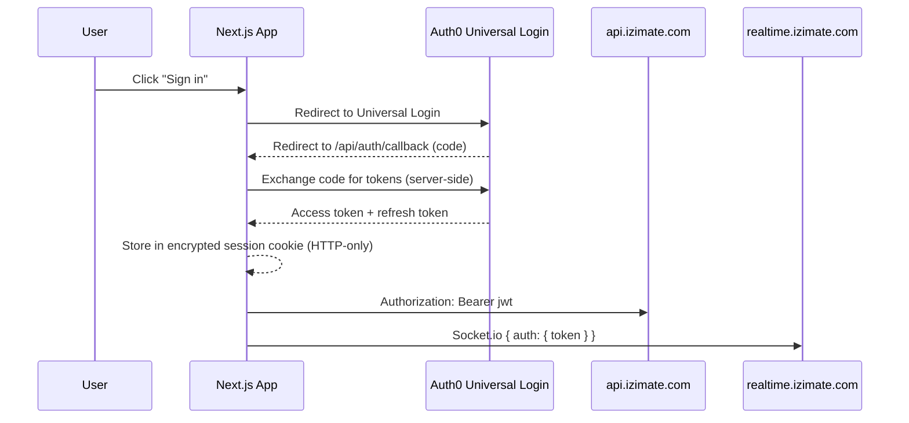

Note: The `/api/auth/*` route handlers (login, callback, logout) are the **only** API routes in Next.js — handled by the Auth0 SDK. All data goes through `api.izimate.com` (Lambda).

### JWT Verification (All Server-Side Services)

```typescript
// packages/db/src/auth.ts (server-side only — avoids bundling jose in clients)
import { jwtVerify, createRemoteJWKSet } from 'jose';

const AUTH0_DOMAIN = process.env.AUTH0_DOMAIN!;
const AUTH0_AUDIENCE = process.env.AUTH0_AUDIENCE!;

const JWKS = createRemoteJWKSet(
  new URL(`https://${AUTH0_DOMAIN}/.well-known/jwks.json`)
);

export async function verifyToken(token: string) {
  const { payload } = await jwtVerify(token, JWKS, {
    issuer: `https://${AUTH0_DOMAIN}/`,
    audience: AUTH0_AUDIENCE,
  });
  return payload;
}
```

Used identically in Lambda API (Fastify middleware), Fargate (Socket.io `connection` handler), and worker Lambdas (if needed). Same `verifyToken()` function, same Fastify plugin — one framework, one auth pattern. Lives in `@izimate/db` (not `@izimate/shared`) because `jose` is only needed server-side.

---

## 7. API Server Detail (Fastify on Lambda)

### Why Fastify for Everything

- **One framework across the entire backend** — API Lambda and realtime Fargate both use Fastify 5. Same plugin system, same middleware patterns, same mental model.
- **Official Lambda adapter** — `@fastify/aws-lambda` is maintained by the Fastify team.
- **Zod validation** — `fastify-type-provider-zod` gives per-route schema validation with automatic TypeScript inference.
- **Rich plugin ecosystem** — `@fastify/cors`, `@fastify/rate-limit`, `@fastify/auth` — battle-tested, not reinventing the wheel.

| Property | Value |
|----------|-------|
| **Runtime** | AWS Lambda via `@fastify/aws-lambda` |
| **Bundle size** | ~200 KB (fast enough — warm after first invocation) |
| **Validation** | Zod via `fastify-type-provider-zod` |
| **Middleware** | Auth, CORS, rate limiting — Fastify plugins |
| **Cold start** | ~100-200ms with Node.js 22 runtime + ESM |

### Route Structure

```typescript
// apps/api/src/index.ts
import Fastify from 'fastify';
import awsLambdaFastify from '@fastify/aws-lambda';
import cors from '@fastify/cors';
import {
  serializerCompiler,
  validatorCompiler,
  type ZodTypeProvider,
} from 'fastify-type-provider-zod';
import { authPlugin } from './middleware/auth';
import { usersRoutes } from './routes/users';
import { uploadsRoutes } from './routes/uploads';
import { webhookRoute } from './routes/webhooks';
// ... domain route modules

const app = Fastify().withTypeProvider<ZodTypeProvider>();
app.setValidatorCompiler(validatorCompiler);
app.setSerializerCompiler(serializerCompiler);

await app.register(cors, { origin: ['https://izimate.com', /localhost/] });

// Webhooks — NO auth (uses signature verification)
await app.register(webhookRoute, { prefix: '/webhooks' });

// All /api/* routes — JWT auth required
await app.register(async (authedApp) => {
  await authedApp.register(authPlugin);
  await authedApp.register(usersRoutes,   { prefix: '/api/users' });
  await authedApp.register(uploadsRoutes, { prefix: '/api/uploads' });
  // ... domain routes registered here with /api/ prefix
});

await app.ready();
export const handler = awsLambdaFastify(app);
```

### Route Example with Zod Validation

```typescript
// apps/api/src/routes/resources.ts
import { z } from 'zod';
import { type FastifyPluginAsyncZod } from 'fastify-type-provider-zod';
import { ResourceSchema, CreateResourceSchema } from '@izimate/shared';
import { db, resources } from '@izimate/db';

export const resourcesRoutes: FastifyPluginAsyncZod = async (app) => {
  app.get('/', {
    schema: {
      querystring: z.object({
        status: z.string().optional(),
        limit: z.coerce.number().default(20),
        offset: z.coerce.number().default(0),
      }),
      response: { 200: z.array(ResourceSchema) },
    },
    handler: async (req) => {
      // req.query is fully typed: { status?: string, limit: number, ... }
      return db.select().from(resources).where(/* ... */);
    },
  });

  app.post('/', {
    schema: {
      body: CreateResourceSchema,  // Zod schema from @izimate/shared
      response: { 201: ResourceSchema },
    },
    handler: async (req, reply) => {
      // req.body is fully typed and validated before handler runs
      const [resource] = await db.insert(resources).values(req.body).returning();
      return reply.code(201).send(resource);
    },
  });
};
```

### Type-Safe Client (Shared Zod Schemas)

```typescript
// packages/api-client/src/http/resources.ts
import { z } from 'zod';
import { ResourceSchema, CreateResourceSchema } from '@izimate/shared';
import { apiClient } from './client';

type Resource = z.infer<typeof ResourceSchema>;

export const resourcesApi = {
  list: (params?: { status?: string }) =>
    apiClient.get<Resource[]>('/api/resources', { params }),

  get: (id: string) =>
    apiClient.get<Resource>(`/api/resources/${id}`),

  create: (data: z.infer<typeof CreateResourceSchema>) =>
    apiClient.post<Resource>('/api/resources', data),
};

// Usage in mobile/web — typed via shared Zod schemas:
const { data } = useQuery({ queryKey: ['resources'], queryFn: () => resourcesApi.list() });
//      ^? Resource[]
```

Types flow from `@izimate/shared` Zod schemas → API validation → `api-client` return types. One source of truth, no code generation.

### Lambda Configuration

| Setting | Value |
|---------|-------|
| **Runtime** | Node.js 22 (ES modules, current LTS) |
| **Memory** | 512 MB (good balance for cold start vs cost) |
| **Timeout** | 30 seconds |
| **Architecture** | arm64 (20% cheaper) |
| **Provisioned concurrency** | 0 (not needed at startup — add if cold starts matter) |
| **Bundler** | esbuild (via Pulumi or custom) |
| **Concurrency limit** | 1,000 (default) — handles ~10-20k req/s at 50-100ms avg |

---

## 8. Realtime Server Detail

### Namespaces

| Namespace | Purpose | Events |
|-----------|---------|--------|
| `/chat` | Messaging | `message:send`, `message:read`, `typing:start`, `typing:stop` |
| `/presence` | Online status | `user:online`, `user:offline`, `user:away` |
| `/notifications` | In-app alerts | `notification:new`, `notification:read` |

Additional namespaces are added as domain features require them — same pattern (room-based pub/sub).

### SNS Event Subscription

Fargate subscribes to the SNS `events` topic via HTTPS. SNS delivers events to ALB → Fargate:

```typescript
// apps/realtime/src/internal/events.ts

// SNS sends Content-Type: text/plain — tell Fastify to parse it as JSON
app.addContentTypeParser('text/plain', { parseAs: 'string' }, (req, body, done) => {
  try { done(null, JSON.parse(body as string)); }
  catch (err) { done(err as Error); }
});

app.post('/internal/events', async (req, reply) => {
  // SNS sends subscription confirmation on first setup
  if (req.headers['x-amz-sns-message-type'] === 'SubscriptionConfirmation') {
    await fetch(req.body.SubscribeURL);  // Confirm subscription
    return reply.code(200).send();
  }

  // Normal event delivery
  const event = JSON.parse(req.body.Message);
  const { namespace, room, type, data } = event;
  io.of(namespace).to(room).emit(type, data);
  return reply.code(200).send({ ok: true });
});
```

Publishing from any Lambda (API, cron, worker):
```typescript
// packages/db/src/events.ts (server-side only — uses AWS SDK)
import { SNSClient, PublishCommand } from '@aws-sdk/client-sns';
import type { AppEvent } from '@izimate/shared';

const sns = new SNSClient({});

export async function publishEvent(event: AppEvent) {
  await sns.send(new PublishCommand({
    TopicArn: process.env.EVENTS_TOPIC_ARN,
    Message: JSON.stringify(event),
    MessageAttributes: {
      eventType: { DataType: 'String', StringValue: event.type },
    },
  }));
}

// Usage:
await publishEvent({
  type: 'entity:updated',
  namespace: '/notifications',
  room: entity.ownerId,
  data: entity,
});
```

### Sticky Sessions (Day 1)

Socket.io performs an Engine.IO HTTP handshake before upgrading to WebSocket. The handshake and upgrade must hit the same Fargate task. ALB application-based cookie ensures this.

```
ALB Target Group:
  Stickiness: Enabled
  Type: Application-based cookie (AWSALB)
  Duration: 86400s (1 day)
```

### Redis Pub/Sub Adapter (Day 1)

ElastiCache Redis in the same VPC — sub-millisecond pub/sub for cross-instance message broadcast.

```typescript
import { createAdapter } from '@socket.io/redis-adapter';
import { createClient } from 'redis';

const pubClient = createClient({ url: process.env.REDIS_URL });
const subClient = pubClient.duplicate();
await pubClient.connect();
await subClient.connect();
io.adapter(createAdapter(pubClient, subClient));
```

### Fargate Task Spec

| Setting | Value |
|---------|-------|
| **CPU** | 0.5 vCPU |
| **Memory** | 1 GB |
| **Desired count** | 1 (scale to 2+ when needed) |
| **Capacity** | ~5,000-10,000 concurrent connections per task |
| **Auto-scaling** | CPU > 70% → add task |

---

## 9. Database

### Neon Serverless Postgres

| Property | Value |
|----------|-------|
| **Plan** | Free → Pro ($19/mo) |
| **Driver** | `@neondatabase/serverless` (HTTP, no TCP) |
| **ORM** | Drizzle |
| **Branching** | One branch per PR / preview deployment |
| **Connection from Lambda** | Neon serverless HTTP driver (no connection pooling needed, no VPC) |
| **Connection from Fargate** | Same HTTP driver or standard `pg` over TCP |

### Drizzle Schema (Source of Truth)

```typescript
// packages/db/src/schema/users.ts
import { pgTable, uuid, text, timestamp } from 'drizzle-orm/pg-core';

export const users = pgTable('users', {
  id: uuid('id').primaryKey().defaultRandom(),
  auth0Id: text('auth0_id').notNull().unique(),
  email: text('email').notNull().unique(),
  name: text('name').notNull(),
  avatarUrl: text('avatar_url'),
  createdAt: timestamp('created_at').defaultNow(),
  updatedAt: timestamp('updated_at').defaultNow(),
});
```

Types are inferred from schema — no separate type definitions needed:

```typescript
import { users } from '@izimate/db';
type User = typeof users.$inferSelect;
type NewUser = typeof users.$inferInsert;
```

### Migrations

```bash
# Generate migration from schema changes
pnpm --filter @izimate/db drizzle-kit generate

# Push to Neon (dev)
pnpm --filter @izimate/db drizzle-kit push

# Apply migrations (production)
pnpm --filter @izimate/db drizzle-kit migrate
```

---

## 10. Background Jobs & Async Processing

### SQS Queues

Email and push queues are **direct-produce** — services call `queueEmail()` / `queuePush()` which send messages straight to SQS. These are **not** SNS-subscribed because their message shapes differ from realtime events (see Section 4c).

| Queue | Producer | Consumer (Lambda) | Action |
|-------|----------|--------------------|--------|
| `email` | API Lambda, Cron Lambda | `apps/workers/src/email.ts` | Call Resend API |
| `push` | API Lambda, Cron Lambda, Fargate | `apps/workers/src/push.ts` | Call Expo Push API |

Each queue has a dead-letter queue (DLQ) for failed messages after 3 retries.

```typescript
// packages/db/src/queue.ts (server-side — used by API Lambda + workers + cron)
import { SQSClient, SendMessageCommand } from '@aws-sdk/client-sqs';

const sqs = new SQSClient({});

export async function queueEmail(to: string, template: string, data: Record<string, unknown>) {
  await sqs.send(new SendMessageCommand({
    QueueUrl: process.env.EMAIL_QUEUE_URL,
    MessageBody: JSON.stringify({ to, template, data }),
  }));
}

export async function queuePush(
  userId: string,
  title: string,
  body: string,
  data?: Record<string, unknown>,  // Deep linking payload
) {
  await sqs.send(new SendMessageCommand({
    QueueUrl: process.env.PUSH_QUEUE_URL,
    MessageBody: JSON.stringify({ userId, title, body, data }),
  }));
}
```

### EventBridge Scheduler (Cron Jobs)

| Schedule | Lambda Function | Action |
|----------|----------------|--------|
| `rate(15 minutes)` | `push-receipts` | Check Expo push receipts → purge invalid tokens |
| `rate(1 day)` | `cleanup` | Deactivate stale records, purge expired tokens |

Domain-specific scheduled jobs (e.g., expiration checks, reminders) are added as separate Lambda functions with the same pattern — EventBridge triggers, SQS for side-effects, SNS for realtime.

```typescript
// apps/workers/src/cron/example.ts (pattern for any scheduled job)
import { db, someTable, users, eq, lte, and } from '@izimate/db';
import { queueEmail, queuePush } from '@izimate/db/queue';
import { publishEvent } from '@izimate/db/events';
import type { ScheduledHandler } from 'aws-lambda';

export const handler: ScheduledHandler = async () => {
  // 1. Query for records matching time-based conditions
  const expired = await db
    .select()
    .from(someTable)
    .where(and(eq(someTable.status, 'active'), lte(someTable.expiresAt, new Date())));

  for (const record of expired) {
    // 2. Update DB state
    await db.update(someTable).set({ status: 'closed' }).where(eq(someTable.id, record.id));

    // 3. Notify affected user
    const [owner] = await db.select().from(users).where(eq(users.id, record.ownerId));
    await queueEmail(owner.email, 'status-changed', { record });
    await queuePush(record.ownerId, 'Status Update', 'Your item status has changed');

    // 4. Push realtime event to connected clients
    await publishEvent({
      type: 'record:updated',
      namespace: '/notifications',
      room: record.ownerId,
      data: { recordId: record.id },
    });
  }
};
```

**Why not BullMQ / node-cron on Fargate?** Separating scheduled work into Lambda + EventBridge means:
- Fargate stays lean (only WebSockets) — no cron library, no job queue overhead
- Each cron job is independently deployable, testable, and observable
- EventBridge handles schedule reliability — no missed jobs if Fargate restarts
- Lambda scales each job independently (a heavy expiration job doesn't affect realtime)
- Built-in CloudWatch metrics per function (duration, errors, invocations)

---

## 11. Push Notifications (Expo Push API)

### How It Works

Expo provides a unified push notification gateway. The mobile app registers with APNs (iOS) and FCM (Android) via `expo-notifications`, receives an **Expo Push Token**, and sends it to our API. Server-side, we send pushes to Expo's endpoint — Expo handles delivery to APNs/FCM.

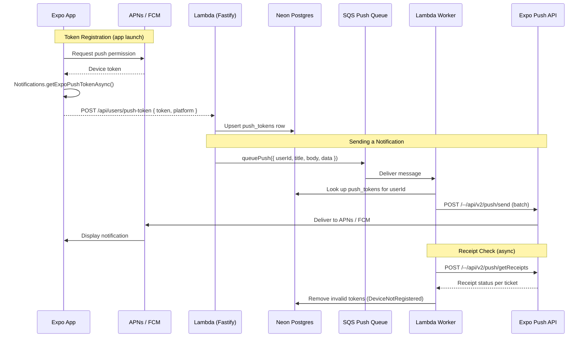

### Client-Side Setup

```typescript
// apps/mobile/src/lib/notifications.ts
import * as Notifications from 'expo-notifications';
import * as Device from 'expo-device';
import { Platform } from 'react-native';
import Constants from 'expo-constants';
import { usersApi } from '@izimate/api-client';

// Configure how notifications appear when app is in foreground
Notifications.setNotificationHandler({
  handleNotification: async () => ({
    shouldShowAlert: true,
    shouldPlaySound: true,
    shouldSetBadge: true,
  }),
});

export async function registerForPushNotifications() {
  if (!Device.isDevice) return null; // Push doesn't work on simulators

  const { status: existing } = await Notifications.getPermissionsAsync();
  let finalStatus = existing;

  if (existing !== 'granted') {
    const { status } = await Notifications.requestPermissionsAsync();
    finalStatus = status;
  }
  if (finalStatus !== 'granted') return null;

  const { data: token } = await Notifications.getExpoPushTokenAsync({
    projectId: Constants.expoConfig?.extra?.eas?.projectId,
  });

  // Send token to our API — upsert in DB
  await usersApi.registerPushToken(token, Platform.OS as 'ios' | 'android');

  return token;
}
```

### Token Storage (Drizzle Schema)

```typescript
// packages/db/src/schema/push-tokens.ts
import { pgTable, uuid, text, timestamp } from 'drizzle-orm/pg-core';
import { users } from './users';

export const pushTokens = pgTable('push_tokens', {
  id: uuid('id').primaryKey().defaultRandom(),
  userId: uuid('user_id').notNull().references(() => users.id, { onDelete: 'cascade' }),
  token: text('token').notNull().unique(),  // ExponentPushToken[xxx]
  platform: text('platform').notNull(),     // 'ios' | 'android'
  createdAt: timestamp('created_at').defaultNow(),
  updatedAt: timestamp('updated_at').defaultNow(),
});
```

A user can have **multiple tokens** (multiple devices). The `unique` constraint on `token` prevents duplicates. `ON DELETE CASCADE` cleans up tokens when user is deleted.

Ticket tracking for receipt checking:

```typescript
// packages/db/src/schema/push-receipts.ts
import { pgTable, uuid, text, boolean, timestamp } from 'drizzle-orm/pg-core';

export const pushReceipts = pgTable('push_receipts', {
  id: uuid('id').primaryKey().defaultRandom(),
  ticketId: text('ticket_id').notNull().unique(),
  token: text('token').notNull(),           // Expo push token (for cleanup on failure)
  processed: boolean('processed').default(false),
  createdAt: timestamp('created_at').defaultNow(),
});
```

### API Endpoint

```typescript
// apps/api/src/routes/users.ts (inside usersRoutes)
// Note: authPlugin decorates req with req.userId from the verified JWT
app.post('/push-token', {
  schema: {
    body: z.object({
      token: z.string().startsWith('ExponentPushToken['),
      platform: z.enum(['ios', 'android']),
    }),
  },
  handler: async (req) => {
    await db
      .insert(pushTokens)
      .values({ userId: req.userId, token: req.body.token, platform: req.body.platform })
      .onConflictDoUpdate({ target: pushTokens.token, set: { updatedAt: new Date() } });
    return { ok: true };
  },
});
```

### Worker Implementation (SQS Consumer)

```typescript
// apps/workers/src/push.ts
import { Expo, type ExpoPushMessage } from 'expo-server-sdk';
import { db, pushTokens, pushReceipts, eq } from '@izimate/db';
import type { SQSHandler } from 'aws-lambda';

const expo = new Expo();

export const handler: SQSHandler = async (event) => {
  for (const record of event.Records) {
    const { userId, title, body, data } = JSON.parse(record.body);

    // 1. Look up all push tokens for this user
    const tokens = await db
      .select()
      .from(pushTokens)
      .where(eq(pushTokens.userId, userId));

    if (tokens.length === 0) continue;

    // 2. Build messages (one per device token)
    const messages: ExpoPushMessage[] = tokens
      .filter((t) => Expo.isExpoPushToken(t.token))
      .map((t) => ({
        to: t.token,
        sound: 'default',
        title,
        body,
        data, // Custom payload — used for deep linking on tap
      }));

    if (messages.length === 0) continue;

    // 3. Send in chunks (Expo recommends batches of ~100)
    const chunks = expo.chunkPushNotifications(messages);

    for (const chunk of chunks) {
      const tickets = await expo.sendPushNotificationsAsync(chunk);

      // 4. Store ticket IDs for receipt checking (cron job checks ~15min later)
      for (let i = 0; i < tickets.length; i++) {
        const ticket = tickets[i];
        if (ticket.status === 'ok') {
          await db.insert(pushReceipts).values({ ticketId: ticket.id, token: chunk[i].to as string });
        } else if (ticket.status === 'error' && ticket.details?.error === 'DeviceNotRegistered') {
          // Token is invalid — remove from DB immediately
          await db.delete(pushTokens).where(eq(pushTokens.token, chunk[i].to as string));
        }
      }
    }
  }
};
```

### Receipt Checking (Cron)

Expo recommends checking push receipts ~15 minutes after sending. A cron job handles this:

```typescript
// apps/workers/src/cron/push-receipts.ts (EventBridge: rate(15 minutes))
import { Expo } from 'expo-server-sdk';
import { db, pushTokens, pushReceipts, eq } from '@izimate/db';

const expo = new Expo();

export const handler = async () => {
  // Pull unprocessed ticket IDs stored when the push worker sent notifications
  const pending = await db
    .select()
    .from(pushReceipts)
    .where(eq(pushReceipts.processed, false));

  const ticketIds = pending.map((r) => r.ticketId);
  if (ticketIds.length === 0) return;

  const chunks = expo.chunkPushNotificationReceiptIds(ticketIds);

  for (const chunk of chunks) {
    const receipts = await expo.getPushNotificationReceiptsAsync(chunk);

    for (const [ticketId, receipt] of Object.entries(receipts)) {
      if (receipt.status === 'error' && receipt.details?.error === 'DeviceNotRegistered') {
        // Token expired or user uninstalled — purge from DB
        const row = pending.find((r) => r.ticketId === ticketId);
        if (row) await db.delete(pushTokens).where(eq(pushTokens.token, row.token));
      }
      await db.update(pushReceipts).set({ processed: true }).where(eq(pushReceipts.ticketId, ticketId));
    }
  }
};
```

### Notification Triggers

Push notifications are triggered by application events (status changes, new messages, payment confirmations, reminders, etc.). The specific triggers are defined by business logic — this system provides the infrastructure to send them via `queuePush()` → SQS → Lambda worker → Expo Push API.

**Key rule:** If the user is **online** (connected to Socket.io `/notifications` namespace), we send an in-app realtime notification only — no push. Push is only for **offline** users. The push worker checks presence via a simple DB flag or Redis key set by the realtime server on connect/disconnect.

### Expo Push API Details

| Property | Value |
|----------|-------|
| **SDK** | `expo-server-sdk` npm package |
| **Endpoint** | `https://exp.host/--/api/v2/push/send` |
| **Batch size** | Up to 100 messages per request |
| **Rate limit** | 600 req/min (generous, scales with plan) |
| **Receipt check** | `POST /--/api/v2/push/getReceipts` — check ~15min after send |
| **Cost** | **Free** — Expo doesn't charge for push delivery |
| **Token format** | `ExponentPushToken[xxxx]` |
| **Platforms** | iOS (APNs), Android (FCM) — unified API |

---

## 12. Email

**Resend** for transactional emails. Email types are defined by business logic — this system provides the worker infrastructure (`queueEmail()` → SQS → Lambda → Resend) to send them.

Auth0 handles auth-related emails (password reset, email verification) natively.

| Resend | Detail |
|--------|--------|
| **Free tier** | 3,000 emails/mo, 100/day |
| **Paid** | $20/mo for 50k emails |
| **SDK** | `resend` npm package |
| **Templates** | React Email (JSX-based email templates) |

---

## 13. Image Handling

### Upload Flow

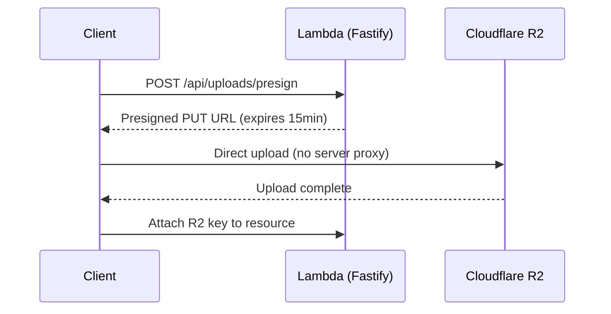

### Image Optimization

Cloudflare Image Transformations (available with R2):
- On-the-fly resize via URL params: `/cdn-cgi/image/width=400,format=webp/image.jpg`
- No separate processing pipeline needed
- Cached at edge globally

---

## 14. Search

### Phase 1: Postgres Full-Text Search

Good enough for an application with <100k searchable records:

```typescript
// Drizzle query with Postgres tsvector
import { sql } from 'drizzle-orm';
import { db, items } from '@izimate/db';

const tsVector = sql`to_tsvector('english', ${items.title} || ' ' || ${items.description})`;
const tsQuery = sql`plainto_tsquery('english', ${searchQuery})`;

const results = await db
  .select()
  .from(items)
  .where(sql`${tsVector} @@ ${tsQuery}`)
  .orderBy(sql`ts_rank(${tsVector}, ${tsQuery}) DESC`)
  .limit(20);
```

### Phase 2 (If Needed): Typesense / Meilisearch

When search needs get complex (facets, typo tolerance, geo-radius):
- **Typesense Cloud**: $29/mo, managed, fast
- **Meilisearch Cloud**: $30/mo, managed
- Sync from Postgres via DB triggers or cron

---

## 15. Monitoring & Error Tracking

| Tool | Purpose | Cost |
|------|---------|------|
| **Sentry** | Error tracking (mobile, web, Lambda, Fargate) | Free tier: 5k events/mo |
| **CloudWatch** | Lambda metrics + Fargate logs + SQS DLQ alarms | Included with AWS |
| **Vercel Analytics** | Web vitals | Free with Vercel |
| **Neon Dashboard** | Query performance, connections | Included |
| **X-Ray** | Lambda tracing (optional) | Free tier: 100k traces/mo |

---

## 16. CI/CD

| What | Tool | Trigger |
|------|------|--------|
| **Lint + Type-check** | GitHub Actions | Every PR |
| **Unit tests** | GitHub Actions (Vitest) | Every PR |
| **Preview deploy (web)** | Vercel | Every PR |
| **Preview DB branch** | Neon | Every PR (auto-branch) |
| **Lambda deploy (API + workers)** | GitHub Actions → esbuild → `aws lambda update-function-code` | Merge to main |
| **Fargate deploy** | GitHub Actions → ECR → ECS | Merge to main |
| **Mobile build** | EAS Build | Manual / tag push |
| **E2E tests** | Playwright (web), Maestro (mobile) | Nightly or pre-release |
| **IaC** | Pulumi (via GitHub Actions, S3 state backend) | Merge to main (infra changes only) |

---

## 17. Cost Summary (Monthly)

| Service | Startup | Growth | Notes |
|---------|---------|--------|-------|
| **Neon Postgres** | $0 | $19 | Free tier → Pro |
| **Auth0** | $0 | $0-23 | Free to 25k MAU |
| **API Gateway** | $0 | ~$1 | $1/million requests |
| **Lambda (API + workers + cron)** | $0 | ~$2 | 1M free requests/mo, arm64 pricing |
| **SQS** | $0 | ~$0.50 | 1M free requests/mo |
| **EventBridge Scheduler** | $0 | ~$0.50 | $1/million invocations |
| **ECS Fargate** | $15 | $30 | 0.5 vCPU / 1 GB (realtime only) |
| **ALB** | $16 | $16 | Fixed for WebSocket routing |
| **ElastiCache Redis** | $12 | $12 | t4g.micro, VPC internal |
| **Cloudflare R2** | $0 | $5 | Free: 10GB + 10M reads |
| **Vercel** | $0 | $20 | Free → Pro (UI only, lighter load) |
| **Resend** | $0 | $0-20 | Free: 3k emails/mo |
| **Sentry** | $0 | $0-26 | Free: 5k events/mo |
| **SNS** | $0 | ~$0 | Free: 1M publishes + 100k HTTPS deliveries/mo |
| **Stripe** | 2.9%+30¢ | 2.9%+30¢ | Per transaction |
| **Domain + DNS** | $12/yr | $12/yr | Cloudflare or Route53 |
| | | | |
| **Total** | **~$44/mo** | **~$107-176/mo** | |

---

## 18. Dependency Graph

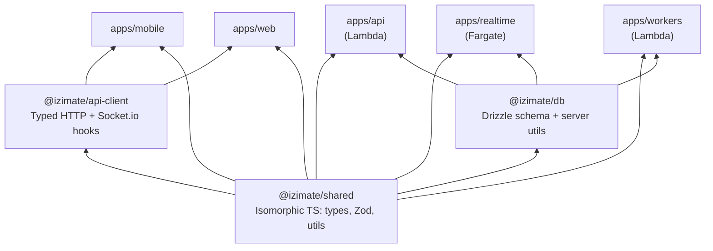

**Hard boundaries:**
- **Clients (mobile + web) never import `@izimate/db`** — they go through `api-client` → Lambda API
- **`@izimate/shared` is isomorphic** — types, Zod schemas, utils. No server-only dependencies (no AWS SDK, no Node.js APIs)
- **`@izimate/api-client` is the single data-access layer** for both mobile and web (typed via shared Zod schemas)
- **`@izimate/db` is imported only by server-side apps** — API Lambda, realtime Fargate, worker Lambdas
- **Next.js web has NO data API routes** — it's a pure UI app on Vercel with only Auth0 route handlers (`/api/auth/*`). All data flows through `api-client`

---

## 19. Summary of Compute Responsibilities

| Compute | What It Does | What It Does NOT Do |
|---------|-------------|--------------------|
| **Vercel (Next.js)** | SSR/SSG web pages, static assets, Auth0 session route handlers | Data API routes, data fetching, webhooks |
| **Lambda — API (Fastify)** | All REST endpoints, webhooks, presigned URLs, auth middleware | WebSockets, cron jobs, email sending |
| **Lambda — Workers** | Process SQS messages: send emails (Resend), push notifications (Expo) | Serve HTTP, hold connections |
| **Lambda — Cron** | EventBridge-triggered scheduled tasks: expiration, reminders, cleanup | Serve HTTP, hold connections |
| **Fargate (Socket.io)** | WebSocket connections, chat rooms, presence, realtime notifications | REST API, cron jobs, email, push |
| **ElastiCache Redis** | Socket.io pub/sub adapter across Fargate instances | Application caching, session storage, rate limiting |
