# iZimate v2 — System Design

## 1. Architecture Overview

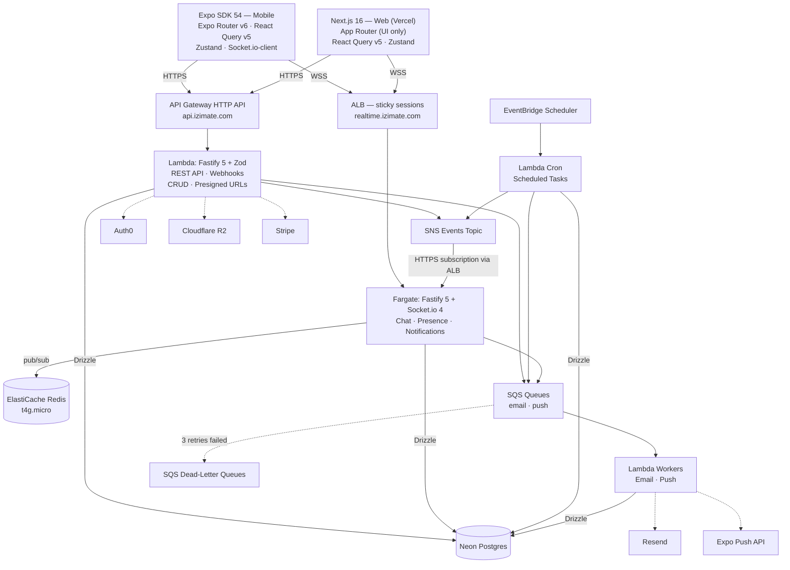

---

## 2. Technology Stack

| Layer                  | Choice                                               | Rationale                                                                  |
| ---------------------- | ---------------------------------------------------- | -------------------------------------------------------------------------- |
| **Mobile**             | Expo SDK 54 + Expo Router v6                         | Proven cross-platform framework                                            |
| **Web**                | Next.js 16 App Router (Vercel)                       | SSR/SSG, UI only — no data API routes (Auth0 route handler only)           |
| **API**                | Fastify 5 + Zod on AWS Lambda (API Gateway HTTP API) | Single API for both clients, same framework as realtime                    |
| **Realtime**           | Fastify 5 + Socket.io 4 (ECS Fargate)                | Persistent WebSockets, rooms, presence                                     |
| **Async workers**      | Lambda + SQS                                         | Email, push notifications, webhook side-effects                            |
| **Scheduled jobs**     | Lambda + EventBridge Scheduler                       | Scheduled tasks: expiration, reminders, cleanup                            |
| **Database**           | Neon Serverless Postgres + Drizzle ORM               | Scale-to-zero, branching, type-safe queries                                |
| **Cache / Pub-Sub**    | ElastiCache Redis (t4g.micro)                        | Sub-ms pub/sub for Socket.io adapter                                       |
| **Auth**               | Auth0                                                | 25k MAU free, social login, standard JWTs                                  |
| **Storage**            | Cloudflare R2                                        | Free egress, S3-compatible, built-in CDN                                   |
| **Payments**           | Stripe                                               | Checkout sessions, Connect payouts, webhooks                               |
| **Email**              | Resend                                               | Transactional emails                                                       |
| **Push notifications** | Expo Push API                                        | Called server-side from Lambda workers                                     |
| **Monitoring**         | Sentry                                               | Error tracking across mobile, web, and server                              |
| **Validation**         | Zod                                                  | Shared schemas between client + server                                     |
| **Client state**       | React Query (server state) + Zustand (client state)  | Minimal, proven                                                            |
| **IaC**                | Pulumi (TypeScript)                                  | Infrastructure as code in the same language as the app; state stored in S3 |
| **Monorepo**           | pnpm workspaces                                      | Same as current, proven                                                    |

---

## 3. Monorepo Structure

```
izimate-v2/
├── apps/
│   ├── mobile/                 # Expo React Native app
│   │   ├── src/
│   │   │   ├── app/            # Expo Router screens
│   │   │   ├── components/     # UI components
│   │   │   ├── hooks/          # ~40-50 consolidated hooks
│   │   │   ├── stores/         # Zustand (user, ui)
│   │   │   └── lib/            # Utils, config, constants
│   │   └── package.json
│   │
│   ├── web/                    # Next.js 16 — UI only, NO data/business API routes
│   │   ├── app/                # App Router pages + Auth0 route handler
│   │   │   └── api/auth/       # Auth0 session only (login, callback, logout)
│   │   ├── components/         # Web UI components
│   │   ├── hooks/              # Web-specific hooks
│   │   ├── lib/                # Utils, auth middleware
│   │   └── package.json
│   │
│   ├── api/                    # Fastify REST API → deployed to Lambda
│   │   ├── src/
│   │   │   ├── routes/         # Route modules
│   │   │   ├── middleware/     # Auth (JWT verify), CORS, rate limiting
│   │   │   ├── services/      # Business logic
│   │   │   └── index.ts       # Fastify app + Lambda adapter
│   │   ├── package.json
│   │   └── tsconfig.json
│   │
│   ├── realtime/               # Fastify + Socket.io → deployed to Fargate
│   │   ├── src/
│   │   │   ├── namespaces/     # Application-defined namespaces
│   │   │   ├── handlers/       # Event handlers per namespace
│   │   │   ├── middleware/     # Auth (JWT verify), rate limiting
│   │   │   ├── internal/      # POST /internal/events (SNS HTTPS subscription)
│   │   │   └── index.ts       # Fastify + Socket.io bootstrap
│   │   ├── Dockerfile
│   │   └── package.json
│   │
│   └── workers/                # Lambda workers → async side-effects
│       ├── src/
│       │   ├── email.ts        # SQS consumer → Resend
│       │   ├── push.ts         # SQS consumer → Expo Push API
│       │   ├── cron/           # EventBridge-triggered scheduled jobs
│       │   │   ├── push-receipts.ts      # Check Expo push receipts → every 15 min
│       │   │   └── cleanup.ts            # Purge stale data → daily
│       │   └── index.ts
│       ├── package.json
│       └── tsconfig.json
│
├── packages/
│   ├── shared/                 # Isomorphic TS — no server-only dependencies
│   │   ├── src/
│   │   │   ├── types/          # Domain types
│   │   │   ├── schemas/        # Zod validation schemas
│   │   │   ├── design/         # Design tokens (colors, spacing, typography)
│   │   │   ├── utils/          # Currency, date, price formatting
│   │   │   └── constants/      # Enums, status codes
│   │   └── package.json
│   │
│   ├── api-client/             # Typed HTTP + Socket.io hooks
│   │   ├── src/                # Used by BOTH mobile and web
│   │   │   ├── http/           # Typed fetch → api.izimate.com (Zod-typed)
│   │   │   ├── socket/         # Socket.io hooks → realtime.izimate.com
│   │   │   └── index.ts
│   │   └── package.json
│   │
│   └── db/                     # Drizzle schema + migrations + server utils
│       ├── src/                # Used by API Lambda + realtime + workers
│       │   ├── schema/         # Table definitions (single source of truth)
│       │   ├── auth.ts         # verifyToken() — jose JWKS (server-side only)
│       │   ├── events.ts       # publishEvent() — SNS helper (server-side only)
│       │   ├── queue.ts        # queueEmail(), queuePush() — SQS helpers
│       │   └── index.ts
│       ├── drizzle/            # Generated migration files
│       └── package.json
│
├── infra/                      # Pulumi IaC (TypeScript, state in S3)
│   ├── Pulumi.yaml             # Project definition
│   ├── Pulumi.prod.yaml        # Production stack config
│   ├── Pulumi.staging.yaml     # Staging stack config
│   ├── index.ts                # Entry point — composes all resources
│   ├── api-gateway.ts          # HTTP API + Lambda integration
│   ├── lambda.ts               # API + worker functions
│   ├── sqs.ts                  # Email + push queues
│   ├── sns.ts                  # Events topic + Fargate HTTPS subscription
│   ├── eventbridge.ts          # Cron schedules
│   ├── fargate.ts              # Socket.io service
│   ├── elasticache.ts          # Redis
│   ├── alb.ts                  # WebSocket load balancer
│   └── vpc.ts                  # Network layout
│
├── pnpm-workspace.yaml
├── package.json
└── tsconfig.json
```

---

## 4. Data Flow

### 4a. HTTP Requests (CRUD)

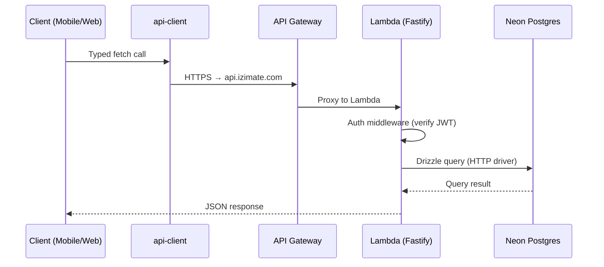

Single path. One API. Both clients.

### 4b. Realtime (Chat, Presence)

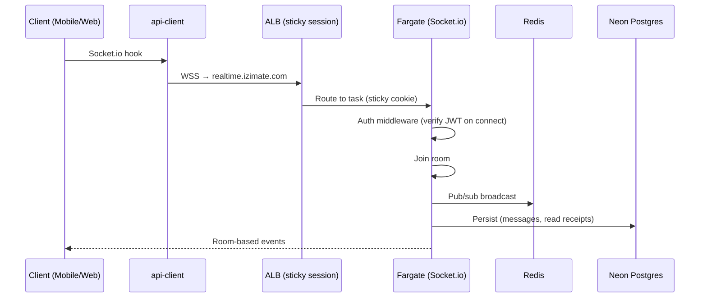

### 4c. Event Bus (SNS → Fargate)

When an API action or cron job needs to push a realtime event to connected clients:

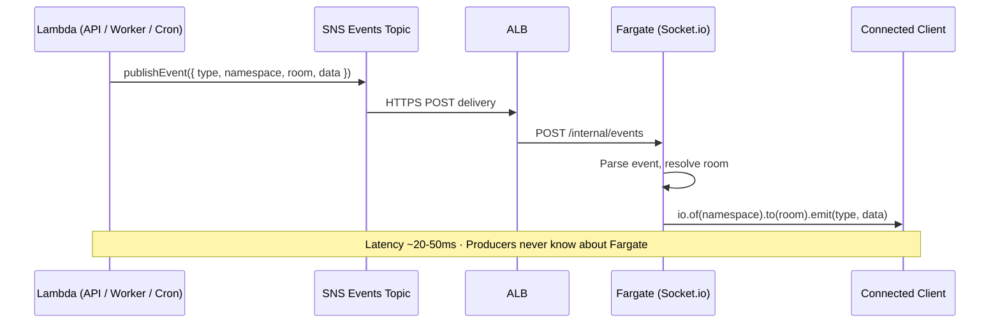

Future consumers (analytics, audit log) can subscribe to the same SNS topic as additional SQS queues — no producer code changes needed:

```
SNS Events Topic
  ├── HTTPS → ALB → Fargate          (existing — realtime)
  ├── SQS → Lambda audit-writer       (future — durable, DLQ)
  └── SQS → Lambda analytics-pipeline (future — durable, DLQ)
```

> **Note:** The email and push SQS queues (Section 10) are **not** subscribed to SNS. They receive messages directly via `queueEmail()` / `queuePush()` because their payloads are fundamentally different from realtime events. SNS carries `{ type, namespace, room, data }` for Socket.io — email and push need their own specific shapes.

### 4d. Async Side-Effects (Email, Push)

When an API action triggers a non-blocking side-effect:

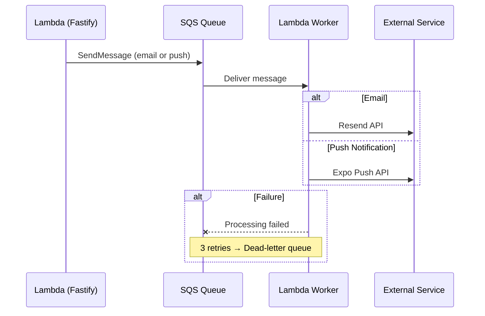

### 4e. Payments

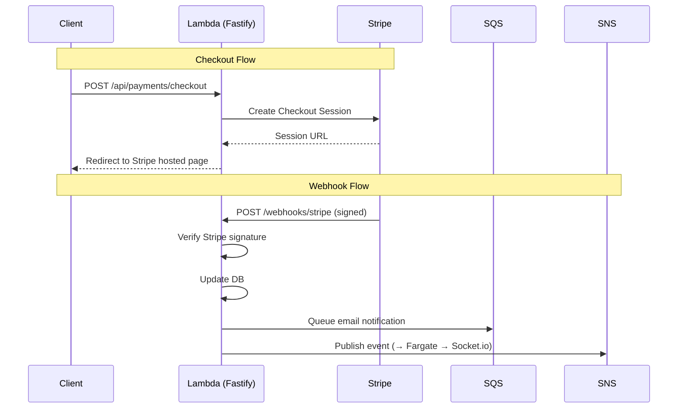

### 4f. Image Upload

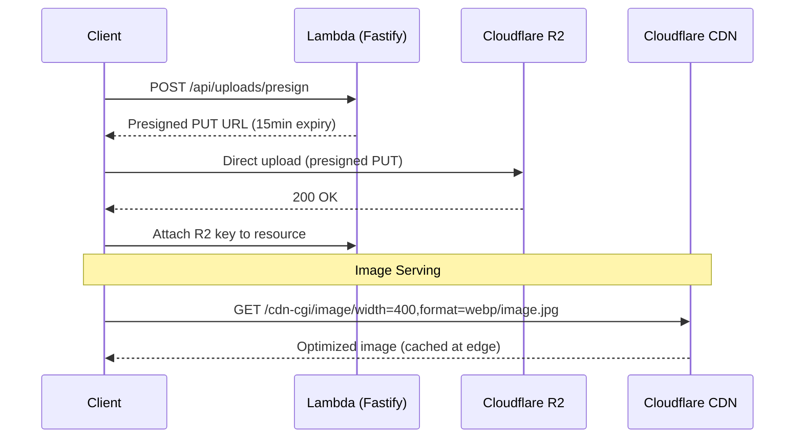

### 4g. Scheduled Jobs

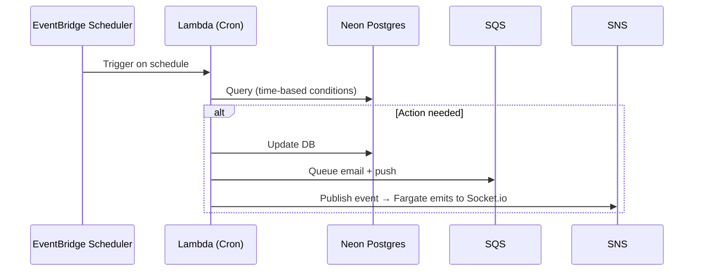

---

## 5. Networking & Infrastructure

### Compute Layout

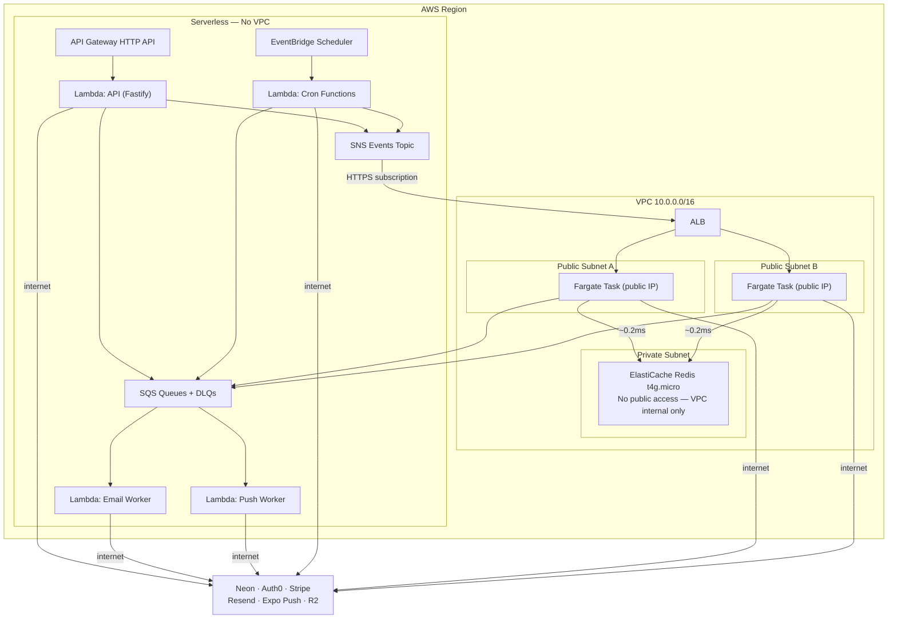

**Lambda runs OUTSIDE the VPC.** This is critical:

- Lambda needs to reach Neon, Auth0, Stripe, Resend, Expo Push, R2 — all on the public internet
- Lambda in a VPC requires a **NAT Gateway** (~$32/mo + data charges) for outbound internet
- Lambda outside VPC has free, instant internet access with zero cold-start penalty
- Lambda does NOT need ElastiCache — only Fargate needs Redis (for Socket.io pub/sub)

**Fargate stays in public subnets** (same as before):

- Auto-assigned public IPs for outbound internet (no NAT Gateway needed)
- Security group restricts inbound to ALB only
- Reaches ElastiCache over VPC internal networking (~0.2ms)

### API Gateway Configuration

| Setting           | Value                                                     |
| ----------------- | --------------------------------------------------------- |
| **Type**          | HTTP API (not REST API — 70% cheaper)                     |
| **Protocol**      | HTTPS only                                                |
| **Stage**         | `$default` (auto-deploy)                                  |
| **CORS**          | Configured for `izimate.com` + `localhost:*`              |
| **Throttle**      | 1,000 req/sec burst, 500 sustained (adjustable)           |
| **Custom domain** | `api.izimate.com` (ACM certificate)                       |
| **Integration**   | Lambda proxy (single function, Fastify routes internally) |

### ALB Configuration

| Setting             | Value                                                              |
| ------------------- | ------------------------------------------------------------------ |
| **Listeners**       | HTTPS :443 (TLS termination)                                       |
| **Target group**    | Fargate tasks, port 3001                                           |
| **Health check**    | `GET /health` on Fastify                                           |
| **Sticky sessions** | Enabled, AWSALB cookie, 1-day duration                             |
| **WebSocket**       | Natively supported (connection stays on same target after upgrade) |
| **Idle timeout**    | 3600s (WebSocket connections are long-lived)                       |

### DNS

| Subdomain                         | Target                         |
| --------------------------------- | ------------------------------ |
| `izimate.com` / `www.izimate.com` | Vercel (Next.js web — UI only) |
| `api.izimate.com`                 | API Gateway → Lambda (Fastify) |
| `realtime.izimate.com`            | ALB → Fargate (Socket.io)      |

---

## 6. Auth Flow

### Mobile (Expo)

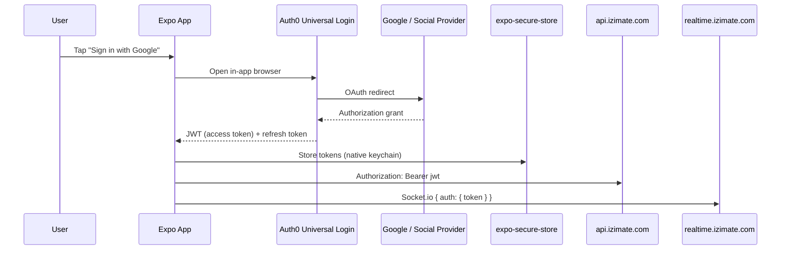

### Web (Next.js)

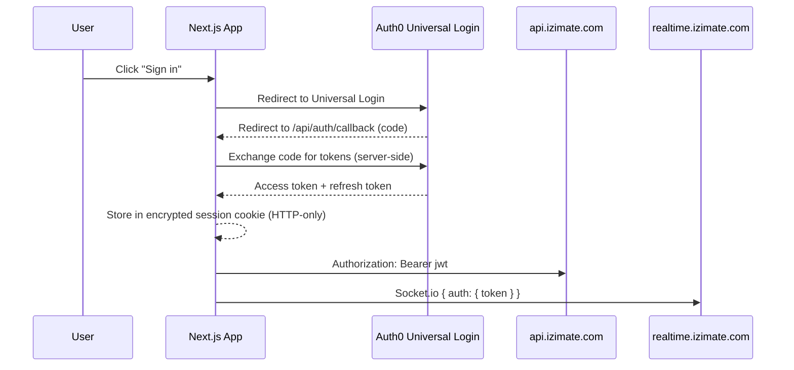

Note: The `/api/auth/*` route handlers (login, callback, logout) are the **only** API routes in Next.js — handled by the Auth0 SDK. All data goes through `api.izimate.com` (Lambda).

### JWT Verification (All Server-Side Services)

A shared `verifyToken()` function in `@izimate/db` uses `jose` to verify Auth0 JWTs via JWKS endpoint. Used identically in Lambda API (Fastify middleware), Fargate (Socket.io `connection` handler), and worker Lambdas. Same function, same Fastify plugin — one framework, one auth pattern. Lives in `@izimate/db` (not `@izimate/shared`) because `jose` is only needed server-side.

> See [IMPLEMENTATION_PATTERNS.md § 1](./IMPLEMENTATION_PATTERNS.md#1-auth--jwt-verification) for the code pattern.

---

## 7. API Server Detail (Fastify on Lambda)

### Why Fastify for Everything

- **One framework across the entire backend** — API Lambda and realtime Fargate both use Fastify 5. Same plugin system, same middleware patterns, same mental model.
- **Official Lambda adapter** — `@fastify/aws-lambda` is maintained by the Fastify team.
- **Zod validation** — `fastify-type-provider-zod` gives per-route schema validation with automatic TypeScript inference.
- **Rich plugin ecosystem** — `@fastify/cors`, `@fastify/rate-limit`, `@fastify/auth` — battle-tested, not reinventing the wheel.

| Property        | Value                                               |
| --------------- | --------------------------------------------------- |
| **Runtime**     | AWS Lambda via `@fastify/aws-lambda`                |
| **Bundle size** | ~200 KB (fast enough — warm after first invocation) |
| **Validation**  | Zod via `fastify-type-provider-zod`                 |
| **Middleware**  | Auth, CORS, rate limiting — Fastify plugins         |
| **Cold start**  | ~100-200ms with Node.js 22 runtime + ESM            |

### Route Structure

Single Fastify app with Zod type provider, exported as a Lambda handler via `@fastify/aws-lambda`. Two registration scopes:

- **Webhook routes** (`/webhooks/*`) — unauthenticated, uses signature verification
- **API routes** (`/api/*`) — JWT-authenticated via `authPlugin`, each domain registers as a Fastify plugin with its own prefix

New features add route modules here — same pattern, same middleware.

### Validation & Type Safety

Routes define Zod schemas for `querystring`, `body`, and `response`. Fastify validates automatically before the handler runs, and TypeScript infers types from the schemas.

Types flow end-to-end: `@izimate/shared` Zod schemas → API route validation → `@izimate/api-client` return types. One source of truth, no code generation.

> See [IMPLEMENTATION_PATTERNS.md § 2–4](./IMPLEMENTATION_PATTERNS.md#2-api-server--fastify-bootstrap) for bootstrap, route, and client code patterns.

### Lambda Configuration

| Setting                     | Value                                                   |
| --------------------------- | ------------------------------------------------------- |
| **Runtime**                 | Node.js 22 (ES modules, current LTS)                    |
| **Memory**                  | 512 MB (good balance for cold start vs cost)            |
| **Timeout**                 | 30 seconds                                              |
| **Architecture**            | arm64 (20% cheaper)                                     |
| **Provisioned concurrency** | 0 (not needed at startup — add if cold starts matter)   |
| **Bundler**                 | esbuild (via Pulumi or custom)                          |
| **Concurrency limit**       | 1,000 (default) — handles ~10-20k req/s at 50-100ms avg |

---

## 8. Realtime Server Detail

### Namespaces

| Namespace        | Purpose       | Events                                                        |
| ---------------- | ------------- | ------------------------------------------------------------- |
| `/chat`          | Messaging     | `message:send`, `message:read`, `typing:start`, `typing:stop` |
| `/presence`      | Online status | `user:online`, `user:offline`, `user:away`                    |
| `/notifications` | In-app alerts | `notification:new`, `notification:read`                       |

Additional namespaces are added as domain features require them — same pattern (room-based pub/sub).

### SNS Event Subscription

Fargate exposes an internal `POST /internal/events` endpoint that receives SNS HTTPS deliveries via the ALB. It handles SNS subscription confirmation automatically. On each event, it parses the `{ namespace, room, type, data }` payload and emits to the appropriate Socket.io room.

Any Lambda (API, cron, worker) publishes events via a shared `publishEvent()` helper in `@izimate/db` that wraps the SNS `PublishCommand`. Producers never know about Fargate — they just publish to the SNS topic.

> See [IMPLEMENTATION_PATTERNS.md § 5–6](./IMPLEMENTATION_PATTERNS.md#5-realtime--sns-event-subscription) for the event handler and publisher code.

### Sticky Sessions (Day 1)

Socket.io performs an Engine.IO HTTP handshake before upgrading to WebSocket. The handshake and upgrade must hit the same Fargate task. ALB application-based cookie (`AWSALB`, 1-day duration) ensures this.

### Redis Pub/Sub Adapter (Day 1)

ElastiCache Redis in the same VPC provides sub-millisecond pub/sub for cross-instance Socket.io message broadcast via the `@socket.io/redis-adapter`.

> See [IMPLEMENTATION_PATTERNS.md § 7](./IMPLEMENTATION_PATTERNS.md#7-realtime--redis-pubsub-adapter) for the adapter setup code.

### Fargate Task Spec

| Setting           | Value                                         |
| ----------------- | --------------------------------------------- |
| **CPU**           | 0.5 vCPU                                      |
| **Memory**        | 1 GB                                          |
| **Desired count** | 1 (scale to 2+ when needed)                   |
| **Capacity**      | ~5,000-10,000 concurrent connections per task |
| **Auto-scaling**  | CPU > 70% → add task                          |

---

## 9. Database

### Neon Serverless Postgres

| Property                    | Value                                                              |
| --------------------------- | ------------------------------------------------------------------ |
| **Plan**                    | Free → Pro ($19/mo)                                                |
| **Driver**                  | `@neondatabase/serverless` (HTTP, no TCP)                          |
| **ORM**                     | Drizzle                                                            |
| **Branching**               | One branch per PR / preview deployment                             |
| **Connection from Lambda**  | Neon serverless HTTP driver (no connection pooling needed, no VPC) |
| **Connection from Fargate** | Same HTTP driver or standard `pg` over TCP                         |

### Drizzle Schema (Source of Truth)

Drizzle schema definitions in `@izimate/db` are the single source of truth for database structure. Types are inferred from schema — no separate type definitions needed (`$inferSelect` / `$inferInsert`). Migrations are generated from schema changes via `drizzle-kit` and applied per environment.

> See [IMPLEMENTATION_PATTERNS.md § 8](./IMPLEMENTATION_PATTERNS.md#8-database--drizzle-schema--migrations) for schema, type inference, and migration commands.

---

## 10. Background Jobs & Async Processing

### SQS Queues

Email and push queues are **direct-produce** — services call `queueEmail()` / `queuePush()` which send messages straight to SQS. These are **not** SNS-subscribed because their message shapes differ from realtime events (see Section 4c).

| Queue   | Producer                         | Consumer (Lambda)           | Action             |
| ------- | -------------------------------- | --------------------------- | ------------------ |
| `email` | API Lambda, Cron Lambda          | `apps/workers/src/email.ts` | Call Resend API    |
| `push`  | API Lambda, Cron Lambda, Fargate | `apps/workers/src/push.ts`  | Call Expo Push API |

Each queue has a dead-letter queue (DLQ) for failed messages after 3 retries.

Server-side helpers (`queueEmail()`, `queuePush()`) in `@izimate/db` wrap SQS `SendMessageCommand` with typed payloads. Used by API Lambda, cron jobs, and Fargate.

> See [IMPLEMENTATION_PATTERNS.md § 9](./IMPLEMENTATION_PATTERNS.md#9-background-jobs--sqs-queue-helpers) for the queue helper code.

### EventBridge Scheduler (Cron Jobs)

| Schedule           | Lambda Function | Action                                          |
| ------------------ | --------------- | ----------------------------------------------- |
| `rate(15 minutes)` | `push-receipts` | Check Expo push receipts → purge invalid tokens |
| `rate(1 day)`      | `cleanup`       | Deactivate stale records, purge expired tokens  |

Domain-specific scheduled jobs (e.g., expiration checks, reminders) are added as separate Lambda functions with the same pattern — EventBridge triggers, SQS for side-effects, SNS for realtime.

The standard cron pattern is: query DB for time-based conditions → update state → queue email/push → publish realtime event.

> See [IMPLEMENTATION_PATTERNS.md § 10](./IMPLEMENTATION_PATTERNS.md#10-background-jobs--cron-job-pattern) for the cron job code pattern.

**Why not BullMQ / node-cron on Fargate?** Separating scheduled work into Lambda + EventBridge means:

- Fargate stays lean (only WebSockets) — no cron library, no job queue overhead
- Each cron job is independently deployable, testable, and observable
- EventBridge handles schedule reliability — no missed jobs if Fargate restarts
- Lambda scales each job independently (a heavy expiration job doesn't affect realtime)
- Built-in CloudWatch metrics per function (duration, errors, invocations)

---

## 11. Push Notifications (Expo Push API)

### How It Works

Expo provides a unified push notification gateway. The mobile app registers with APNs (iOS) and FCM (Android) via `expo-notifications`, receives an **Expo Push Token**, and sends it to our API. Server-side, we send pushes to Expo's endpoint — Expo handles delivery to APNs/FCM.

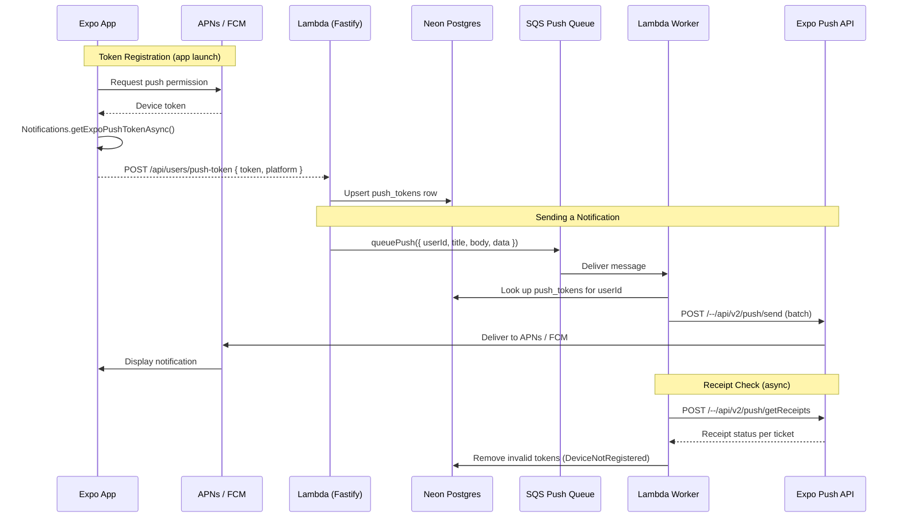

### Client-Side Registration

The mobile app requests push permissions via `expo-notifications`, obtains an Expo Push Token, and sends it to the API for storage. Tokens are stored per-device (a user can have multiple tokens). The API upserts tokens to prevent duplicates.

### Token & Receipt Storage

Two tables support the push notification lifecycle:

- **`push_tokens`** — one row per device token, linked to user via foreign key. `ON DELETE CASCADE` cleans up when user is deleted.
- **`push_receipts`** — tracks Expo ticket IDs for async receipt verification. Marked as processed after the cron job checks delivery status.

### Worker Flow (SQS Consumer)

The push worker receives messages from SQS, looks up all push tokens for the target user, batches them via the Expo SDK (~100 per request), and sends to the Expo Push API. Invalid tokens (`DeviceNotRegistered`) are purged from DB immediately. Successful sends store ticket IDs for receipt checking.

### Receipt Checking (Cron)

A cron job (EventBridge, every 15 minutes) queries the Expo receipts API for unprocessed tickets. Tokens that have become invalid (user uninstalled, token expired) are purged from the `push_tokens` table.

> See [IMPLEMENTATION_PATTERNS.md § 11–15](./IMPLEMENTATION_PATTERNS.md#11-push-notifications--client-registration) for all push notification code patterns.

### Notification Triggers

Push notifications are triggered by application events (status changes, new messages, payment confirmations, reminders, etc.). The specific triggers are defined by business logic — this system provides the infrastructure to send them via `queuePush()` → SQS → Lambda worker → Expo Push API.

**Key rule:** If the user is **online** (connected to Socket.io `/notifications` namespace), we send an in-app realtime notification only — no push. Push is only for **offline** users. The push worker checks presence via a Neon `is_online` flag on the users table, set by the Fargate realtime server on connect/disconnect. Neon is used instead of Redis because Lambda workers run outside the VPC and cannot reach ElastiCache.

### Expo Push API Details

| Property          | Value                                                        |
| ----------------- | ------------------------------------------------------------ |
| **SDK**           | `expo-server-sdk` npm package                                |
| **Endpoint**      | `https://exp.host/--/api/v2/push/send`                       |
| **Batch size**    | Up to 100 messages per request                               |
| **Rate limit**    | 600 req/min (generous, scales with plan)                     |
| **Receipt check** | `POST /--/api/v2/push/getReceipts` — check ~15min after send |
| **Cost**          | **Free** — Expo doesn't charge for push delivery             |
| **Token format**  | `ExponentPushToken[xxxx]`                                    |
| **Platforms**     | iOS (APNs), Android (FCM) — unified API                      |

---

## 12. Email

**Resend** for transactional emails. Email types are defined by business logic — this system provides the worker infrastructure (`queueEmail()` → SQS → Lambda → Resend) to send them.

Auth0 handles auth-related emails (password reset, email verification) natively.

| Resend        | Detail                                  |
| ------------- | --------------------------------------- |
| **Free tier** | 3,000 emails/mo, 100/day                |
| **Paid**      | $20/mo for 50k emails                   |
| **SDK**       | `resend` npm package                    |
| **Templates** | React Email (JSX-based email templates) |

---

## 13. Image Handling

### Upload Flow

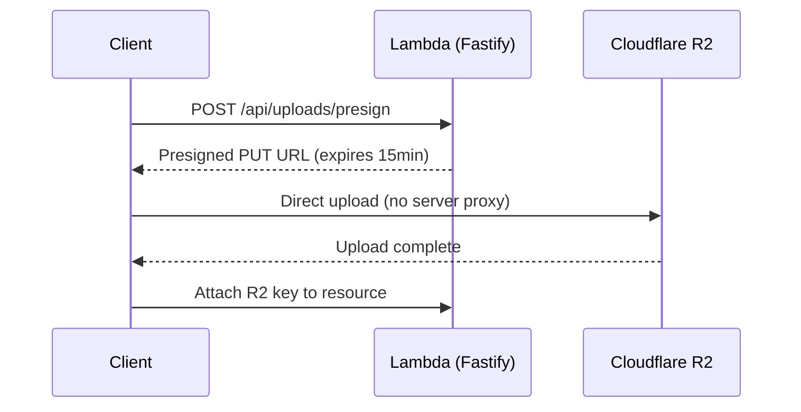

### Image Optimization

Cloudflare Image Transformations (available with R2):

- On-the-fly resize via URL params: `/cdn-cgi/image/width=400,format=webp/image.jpg`
- No separate processing pipeline needed
- Cached at edge globally

---

## 14. Search

### Phase 1: Postgres Full-Text Search

Good enough for an application with <100k searchable records. Uses Postgres `tsvector` / `tsquery` via Drizzle for ranked full-text search with no additional infrastructure.

> See [IMPLEMENTATION_PATTERNS.md § 16](./IMPLEMENTATION_PATTERNS.md#16-search--postgres-full-text-search) for the Drizzle query pattern.

### Phase 2 (If Needed): Typesense / Meilisearch

When search needs get complex (facets, typo tolerance, geo-radius):

- **Typesense Cloud**: $29/mo, managed, fast
- **Meilisearch Cloud**: $30/mo, managed
- Sync from Postgres via DB triggers or cron

---

## 15. Monitoring & Error Tracking

| Tool                 | Purpose                                        | Cost                      |
| -------------------- | ---------------------------------------------- | ------------------------- |
| **Sentry**           | Error tracking (mobile, web, Lambda, Fargate)  | Free tier: 5k events/mo   |
| **CloudWatch**       | Lambda metrics + Fargate logs + SQS DLQ alarms | Included with AWS         |
| **Vercel Analytics** | Web vitals                                     | Free with Vercel          |
| **Neon Dashboard**   | Query performance, connections                 | Included                  |
| **X-Ray**            | Lambda tracing (optional)                      | Free tier: 100k traces/mo |

---

## 16. CI/CD

| What                              | Tool                                                         | Trigger                            |
| --------------------------------- | ------------------------------------------------------------ | ---------------------------------- |
| **Lint + Type-check**             | GitHub Actions                                               | Every PR                           |
| **Unit tests**                    | GitHub Actions (Vitest)                                      | Every PR                           |
| **Preview deploy (web)**          | Vercel                                                       | Every PR                           |
| **Preview DB branch**             | Neon                                                         | Every PR (auto-branch)             |
| **Lambda deploy (API + workers)** | GitHub Actions → esbuild → `aws lambda update-function-code` | Merge to main                      |
| **Fargate deploy**                | GitHub Actions → ECR → ECS                                   | Merge to main                      |
| **Mobile build**                  | EAS Build                                                    | Manual / tag push                  |
| **E2E tests**                     | Playwright (web), Maestro (mobile)                           | Nightly or pre-release             |
| **IaC**                           | Pulumi (via GitHub Actions, S3 state backend)                | Merge to main (infra changes only) |

---

## 17. Cost Summary (Monthly)

| Service                           | Startup     | Growth           | Notes                                         |
| --------------------------------- | ----------- | ---------------- | --------------------------------------------- |
| **Neon Postgres**                 | $0          | $19              | Free tier → Pro                               |
| **Auth0**                         | $0          | $0-23            | Free to 25k MAU                               |
| **API Gateway**                   | $0          | ~$1              | $1/million requests                           |
| **Lambda (API + workers + cron)** | $0          | ~$2              | 1M free requests/mo, arm64 pricing            |
| **SQS**                           | $0          | ~$0.50           | 1M free requests/mo                           |
| **EventBridge Scheduler**         | $0          | ~$0.50           | $1/million invocations                        |
| **ECS Fargate**                   | $15         | $30              | 0.5 vCPU / 1 GB (realtime only)               |
| **ALB**                           | $16         | $16              | Fixed for WebSocket routing                   |
| **ElastiCache Redis**             | $12         | $12              | t4g.micro, VPC internal                       |
| **Cloudflare R2**                 | $0          | $5               | Free: 10GB + 10M reads                        |
| **Vercel**                        | $0          | $20              | Free → Pro (UI only, lighter load)            |
| **Resend**                        | $0          | $0-20            | Free: 3k emails/mo                            |
| **Sentry**                        | $0          | $0-26            | Free: 5k events/mo                            |
| **SNS**                           | $0          | ~$0              | Free: 1M publishes + 100k HTTPS deliveries/mo |
| **Stripe**                        | 2.9%+30¢    | 2.9%+30¢         | Per transaction                               |
| **Domain + DNS**                  | $12/yr      | $12/yr           | Cloudflare or Route53                         |
|                                   |             |                  |                                               |
| **Total**                         | **~$44/mo** | **~$107-176/mo** |                                               |

---

## 18. Dependency Graph

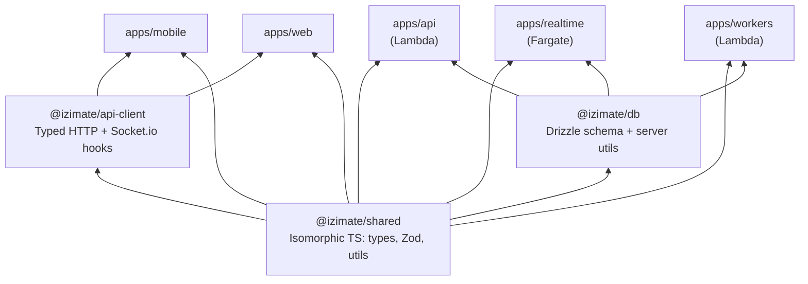

**Hard boundaries:**

- **Clients (mobile + web) never import `@izimate/db`** — they go through `api-client` → Lambda API
- **`@izimate/shared` is isomorphic** — types, Zod schemas, utils. No server-only dependencies (no AWS SDK, no Node.js APIs)
- **`@izimate/api-client` is the single data-access layer** for both mobile and web (typed via shared Zod schemas)
- **`@izimate/db` is imported only by server-side apps** — API Lambda, realtime Fargate, worker Lambdas
- **Next.js web has NO data API routes** — it's a pure UI app on Vercel with only Auth0 route handlers (`/api/auth/*`). All data flows through `api-client`

---

## 19. Summary of Compute Responsibilities

| Compute                    | What It Does                                                          | What It Does NOT Do                                 |
| -------------------------- | --------------------------------------------------------------------- | --------------------------------------------------- |
| **Vercel (Next.js)**       | SSR/SSG web pages, static assets, Auth0 session route handlers        | Data API routes, data fetching, webhooks            |
| **Lambda — API (Fastify)** | All REST endpoints, webhooks, presigned URLs, auth middleware         | WebSockets, cron jobs, email sending                |
| **Lambda — Workers**       | Process SQS messages: send emails (Resend), push notifications (Expo) | Serve HTTP, hold connections                        |
| **Lambda — Cron**          | EventBridge-triggered scheduled tasks: expiration, reminders, cleanup | Serve HTTP, hold connections                        |
| **Fargate (Socket.io)**    | WebSocket connections, chat rooms, presence, realtime notifications   | REST API, cron jobs, email, push                    |
| **ElastiCache Redis**      | Socket.io pub/sub adapter across Fargate instances                    | Application caching, session storage, rate limiting |

---

## 20. Security Foundations

Every feature built on this platform inherits these security patterns. They must be decided at the infrastructure level — not per-feature.

### Authentication

Auth0 handles identity (social login, email/password, MFA). All server-side services verify JWTs via a shared `verifyToken()` function using JWKS. Token storage differs by platform:

- **Mobile**: `expo-secure-store` (native keychain)
- **Web**: Encrypted HTTP-only session cookie (set by Auth0 SDK route handler)

### Authorization

**Ownership-based access control** as the default pattern. Every resource has an `ownerId` (or equivalent FK to `users.id`). The standard authorization check in every route handler:

1. Extract `userId` from verified JWT (done by `authPlugin`)
2. Query the resource
3. Verify `resource.ownerId === req.userId` (or the user is a participant in the resource)
4. Return `403 Forbidden` if not

For resources with **multiple participants** (e.g., a booking with a provider and a customer), both participant IDs are checked. There are no admin roles or RBAC in the MVP — this is a peer-to-peer services exchange platform.

**Route-level guards:** Authorization logic lives in route handlers or thin service functions — not in middleware. Each feature defines its own access rules because resource relationships vary.

### Rate Limiting

| Layer                               | Strategy                      | Config                                                 |
| ----------------------------------- | ----------------------------- | ------------------------------------------------------ |
| **API Gateway**                     | Global throttle               | 1,000 req/sec burst, 500 sustained                     |
| **Fastify (`@fastify/rate-limit`)** | Per-IP + per-user             | Configurable per-route (e.g., auth endpoints stricter) |
| **Socket.io**                       | Per-connection event throttle | Custom middleware on each namespace                    |

Rate limit responses return `429 Too Many Requests` with a `Retry-After` header.

### Secret Management

| Secret                                       | Storage                                          | Accessed By                                |
| -------------------------------------------- | ------------------------------------------------ | ------------------------------------------ |
| `AUTH0_DOMAIN`, `AUTH0_AUDIENCE`             | Lambda environment variables (encrypted at rest) | API Lambda, Workers, Fargate               |
| `STRIPE_SECRET_KEY`, `STRIPE_WEBHOOK_SECRET` | AWS SSM Parameter Store (SecureString)           | API Lambda (fetched at cold start, cached) |
| `DATABASE_URL`                               | Lambda environment variable                      | All server-side compute                    |
| `REDIS_URL`                                  | Fargate environment variable                     | Fargate only                               |
| Resend API key                               | Lambda environment variable                      | Email worker                               |

Non-sensitive config (feature flags, thresholds) uses plain environment variables. Secrets that rotate (Stripe keys) use SSM Parameter Store so rotation doesn't require redeployment.

### Input Validation & Sanitization

- **Zod schemas** validate all request inputs (body, query, params) before handlers execute — rejects malformed data at the framework level
- **Drizzle ORM** parameterizes all queries — prevents SQL injection by design
- **No raw HTML rendering** — React (mobile + web) escapes by default; no `dangerouslySetInnerHTML` without explicit sanitization

### Transport Security

- All client-to-server communication over HTTPS / WSS (TLS termination at API Gateway and ALB)
- Neon connections use TLS by default
- No unencrypted internal traffic — ElastiCache Redis uses in-transit encryption

---

## 21. Error Handling & Resilience

### Standard API Error Response

All API routes return errors in a consistent shape:

```json
{
  "error": {
    "code": "RESOURCE_NOT_FOUND",
    "message": "The requested resource does not exist",
    "statusCode": 404
  }
}
```

| HTTP Status | Usage                                                               |
| ----------- | ------------------------------------------------------------------- |
| `400`       | Zod validation failure (automatic), malformed request               |
| `401`       | Missing or invalid JWT                                              |
| `403`       | Authenticated but not authorized (ownership check failed)           |
| `404`       | Resource not found                                                  |
| `409`       | Conflict (e.g., duplicate resource)                                 |
| `429`       | Rate limit exceeded                                                 |
| `500`       | Unhandled server error (logged to Sentry, generic message returned) |

A Fastify `setErrorHandler` plugin formats all errors into this shape, including Zod validation errors (mapped to 400 with field-level details).

### SQS Failure & Dead-Letter Queues

| Step                            | Behavior                                                                                     |
| ------------------------------- | -------------------------------------------------------------------------------------------- |
| Worker fails to process message | SQS retries up to **3 times** with exponential backoff                                       |
| All retries exhausted           | Message moves to the DLQ                                                                     |
| DLQ alarm                       | CloudWatch alarm triggers on `ApproximateNumberOfMessagesVisible > 0`                        |
| Resolution                      | Manual inspection via AWS Console or CLI; replay by moving messages back to the source queue |

DLQ messages are retained for **14 days** (max SQS retention) to allow investigation.

### SNS → Fargate Failure Mode

SNS HTTPS subscriptions retry 3 times over ~20 seconds. If Fargate is unreachable:

- Events are **lost** — SNS does not have durable retry for HTTPS endpoints
- **Mitigation:** This is acceptable for realtime events (they're transient by nature — if a user isn't connected, they don't need the event). The persistent state change already happened in the DB. Users reconnecting get fresh state from the API.
- **Future hardening (if needed):** Add an SQS subscription to the same SNS topic as a durable buffer, with a Lambda that replays missed events when Fargate recovers.

### External Service Degradation

| Service       | Failure Impact                      | Mitigation                                                                                                         |
| ------------- | ----------------------------------- | ------------------------------------------------------------------------------------------------------------------ |
| **Neon**      | API returns 500s                    | Sentry alert; Neon has 99.95% SLA on Pro. No local fallback — DB is critical path.                                 |
| **Auth0**     | Login fails; JWT verification fails | JWKS is cached in memory after first fetch (jose default). Existing sessions continue working until tokens expire. |
| **Stripe**    | Payments fail                       | Webhook retries (Stripe retries for up to 3 days). Users see a clear error; no silent failures.                    |
| **Resend**    | Emails not delivered                | SQS retries + DLQ. Non-blocking — doesn't affect user-facing flows.                                                |
| **Expo Push** | Push notifications not delivered    | SQS retries + DLQ. Non-blocking; receipt cron cleans up stale tokens.                                              |

### Timeouts

| Compute          | Timeout      | Rationale                                |
| ---------------- | ------------ | ---------------------------------------- |
| Lambda — API     | 30s          | Generous for DB queries + external calls |
| Lambda — Workers | 60s          | Email/push batching may take longer      |
| Lambda — Cron    | 300s (5 min) | Batch processing over many records       |
| Fargate          | No timeout   | Long-lived WebSocket connections         |
| API Gateway      | 30s          | Matches Lambda API timeout               |

---

## 22. Observability Patterns

### Structured Logging

All server-side services (Lambda, Fargate, workers) use structured JSON logs with a consistent shape:

```json
{
  "level": "info",
  "timestamp": "2026-03-09T12:00:00.000Z",
  "correlationId": "req-abc123",
  "service": "api",
  "message": "Resource created",
  "userId": "user-xyz",
  "duration": 45
}
```

Use Fastify's built-in `pino` logger (already included) — it outputs structured JSON by default.

### Correlation IDs

A `correlationId` is generated at the entry point (API Gateway request or SQS message) and propagated through the entire chain:

| Hop           | How it's propagated                             |
| ------------- | ----------------------------------------------- |
| Client → API  | `X-Correlation-ID` header (generated if absent) |
| API → SQS     | Included as `MessageAttribute`                  |
| SQS → Worker  | Extracted from `MessageAttribute`               |
| API → SNS     | Included as `MessageAttribute`                  |
| SNS → Fargate | Extracted from SNS message attributes           |

This allows tracing a single user action (e.g., "create booking") end-to-end across API → SQS → email worker → SNS → Fargate → client.

### Alerting

| Condition                                                       | Alert Channel                            | Severity |
| --------------------------------------------------------------- | ---------------------------------------- | -------- |
| Sentry error spike (>10 events/min)                             | Sentry → Slack webhook                   | High     |
| SQS DLQ has messages (`ApproximateNumberOfMessagesVisible > 0`) | CloudWatch alarm → SNS → email/Slack     | High     |
| Lambda error rate > 5%                                          | CloudWatch alarm                         | Medium   |
| Lambda P99 latency > 5s                                         | CloudWatch alarm                         | Medium   |
| Fargate task unhealthy / restarting                             | ECS event → CloudWatch alarm             | High     |
| Neon connection failures                                        | Sentry (caught in Drizzle error handler) | High     |

**No PagerDuty / on-call at MVP** — alerts go to a Slack channel. Escalate to on-call tooling when the platform has paying users.

---

## 23. Adding a Feature

This section defines the architectural contract for building new features on the iZimate foundation. Every feature follows the same steps — this consistency is the value of the foundation.

### Step-by-Step

**1. Define schemas** in `@izimate/shared`

- Zod schemas for request/response validation
- TypeScript types inferred from schemas (no manual type definitions)
- Shared between client and server

**2. Add database table(s)** in `@izimate/db`

- Drizzle table definition in `packages/db/src/schema/`
- Run `drizzle-kit generate` → `drizzle-kit push` (dev) or `drizzle-kit migrate` (prod)
- Export from `packages/db/src/index.ts`

**3. Add API route module** in `apps/api`

- Create `apps/api/src/routes/{feature}.ts` as a `FastifyPluginAsyncZod`
- Register with prefix in the auth-scoped block in `index.ts`
- Use Zod schemas from step 1 for request/response validation
- Authorization: check resource ownership in handlers

**4. Add typed client functions** in `@izimate/api-client`

- Create `packages/api-client/src/http/{feature}.ts`
- Typed fetch wrappers using the same Zod schemas
- Consumed by both mobile and web via React Query

**5. (If realtime needed)** Add Socket.io namespace/events in `apps/realtime`

- Define events in a new namespace or add to existing (`/chat`, `/notifications`)
- Publish from API/workers via `publishEvent()` → SNS → Fargate

**6. (If async side-effects needed)** Use existing queue infrastructure

- Call `queueEmail()` / `queuePush()` from route handlers or workers
- No new infrastructure — reuses existing SQS queues and Lambda workers

**7. (If scheduled work needed)** Add EventBridge cron Lambda

- New Lambda function in `apps/workers/src/cron/`
- EventBridge schedule defined in `infra/eventbridge.ts`

### What Each Feature Does NOT Do

- Define its own auth middleware (use `authPlugin`)
- Create its own API server or deployment (register as Fastify plugin)
- Define its own error format (use the standard error handler)
- Import `@izimate/db` from client code (go through `api-client`)
- Add API routes to Next.js (all data flows through Lambda)

> See [IMPLEMENTATION_PATTERNS.md](./IMPLEMENTATION_PATTERNS.md) for concrete code examples of each step.
